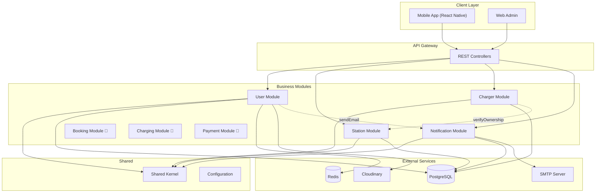
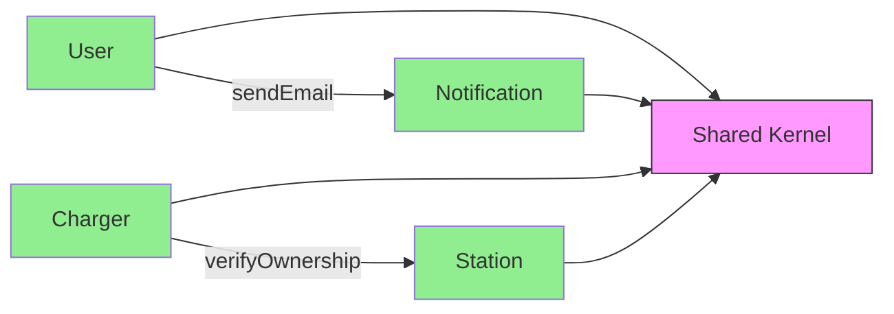

# Tổng quan Backend Features - EV-Go

Tài liệu này cung cấp cái nhìn tổng quan về các module backend đã được implement trong hệ thống EV-Go.

---

## Module Status Overview

| Module | Status | Mô tả | Tài liệu chi tiết |
|--------|--------|-------|-------------------|
| **User** | ✅ Implemented | Xác thực, quản lý người dùng, tài khoản, phương tiện | [walkthrough-user-module.md](walkthrough-user-module.md) |
| **Station** | ✅ Implemented | Quản lý trạm sạc | [walkthrough-station-module.md](walkthrough-station-module.md) |
| **Charger** | ✅ Implemented | Quản lý bộ sạc và cổng sạc | [walkthrough-charger-module.md](walkthrough-charger-module.md) |
| **Notification** | ✅ Implemented | Email, SMS, thông báo | [walkthrough-notification-module.md](walkthrough-notification-module.md) |
| **Shared Kernel** | ✅ Implemented | DTOs, Enums, Exceptions | [walkthrough-sharedkernel-module.md](walkthrough-sharedkernel-module.md) |
| **Booking** | 🔲 Skeleton | Đặt lịch sạc | *Coming soon* |
| **Charging** | 🔲 Skeleton | Phiên sạc | *Coming soon* |
| **Payment** | 🔲 Skeleton | Thanh toán | *Coming soon* |
| **Review** | 🔲 Skeleton | Đánh giá | *Coming soon* |
| **Complaint** | 🔲 Skeleton | Khiếu nại | *Coming soon* |

---

## Architecture Overview



---

## Module Dependencies



---

## API Endpoints Summary

### Authentication (`/api/v1/auth`)

| Method | Endpoint | Mô tả |
|--------|----------|-------|
| POST | `/register` | Đăng ký tài khoản |
| POST | `/login` | Đăng nhập |
| POST | `/refresh` | Làm mới token |
| POST | `/logout` | Đăng xuất |
| POST | `/verify-email` | Xác minh email |
| POST | `/verify-phone` | Xác minh phone |
| POST | `/forgot-password` | Quên mật khẩu |
| POST | `/reset-password` | Đặt lại mật khẩu |
| POST | `/google` | Đăng nhập Google |

### User Profile (`/api/v1/users`)

| Method | Endpoint | Mô tả |
|--------|----------|-------|
| GET | `/me` | Thông tin profile |
| PUT | `/me` | Cập nhật profile |
| PUT | `/me/password` | Đổi mật khẩu |
| POST | `/me/avatar` | Cập nhật avatar |
| GET | `/me/business-profile` | Business profile (Owner) |
| PUT | `/me/business-profile` | Cập nhật business profile |

### Vehicles (`/api/v1/users/me/vehicles`)

| Method | Endpoint | Mô tả |
|--------|----------|-------|
| POST | `/` | Thêm xe |
| GET | `/` | Danh sách xe |
| GET | `/{id}` | Chi tiết xe |
| PUT | `/{id}` | Cập nhật xe |
| DELETE | `/{id}` | Xóa xe |
| PUT | `/{id}/in-use` | Đặt xe đang sử dụng |
| GET | `/in-use` | Lấy xe đang sử dụng |

### Admin (`/api/v1/admin`)

| Method | Endpoint | Mô tả |
|--------|----------|-------|
| GET | `/accounts` | Danh sách tài khoản |
| GET | `/accounts/{id}` | Chi tiết tài khoản |
| POST | `/accounts/{id}/lock` | Khóa tài khoản |
| POST | `/accounts/{id}/unlock` | Mở khóa tài khoản |
| DELETE | `/accounts/{id}` | Xóa tài khoản |
| GET | `/station-owner` | Danh sách đơn đăng ký SO |
| GET | `/station-owner/{id}` | Chi tiết đơn đăng ký |
| PUT | `/station-owner/{id}` | Đánh dấu đang xem xét |
| POST | `/station-owner/{id}/approve` | Duyệt đơn |
| POST | `/station-owner/{id}/reject` | Từ chối đơn |

### Stations (`/api/v1/stations`)

| Method | Endpoint | Mô tả |
|--------|----------|-------|
| GET | `/` | Danh sách trạm sạc |
| GET | `/{id}` | Chi tiết trạm |
| GET | `/me` | Trạm của tôi (Owner) |
| POST | `/` | Tạo trạm |
| PUT | `/{id}` | Cập nhật trạm |
| DELETE | `/{id}` | Xóa trạm |
| PATCH | `/{id}/status` | Cập nhật trạng thái |

### Chargers (`/api/v1/chargers`)

| Method | Endpoint | Mô tả |
|--------|----------|-------|
| GET | `/?stationId={id}` | Danh sách charger theo station |
| GET | `/{id}` | Chi tiết charger |
| POST | `/` | Tạo charger |
| PUT | `/{id}` | Cập nhật charger |
| DELETE | `/{id}` | Xóa charger |
| GET | `/{id}/ports` | Danh sách port |
| POST | `/{id}/ports` | Tạo port |

### Ports (`/api/v1/ports`)

| Method | Endpoint | Mô tả |
|--------|----------|-------|
| GET | `/{id}` | Chi tiết port |
| PUT | `/{id}` | Cập nhật trạng thái port |
| DELETE | `/{id}` | Xóa port |

### Notifications (`/api/v1/notifications`)

| Method | Endpoint | Mô tả |
|--------|----------|-------|
| GET | `/{id}` | Chi tiết thông báo |
| GET | `/user/{userId}` | Thông báo của user |
| GET | `/user/{userId}/unread` | Thông báo chưa đọc |
| GET | `/user/{userId}/unread/count` | Đếm chưa đọc |

---

## User Roles & Permissions

| Role | Mô tả | Quyền hạn chính |
|------|-------|-----------------|
| **USER** | Người dùng thường | Tìm trạm, đặt lịch, sạc xe |
| **STATION_OWNER** | Chủ trạm sạc | Quản lý trạm, charger, xem thống kê |
| **SUPER_ADMIN** | Quản trị viên | Quản lý tài khoản, duyệt đơn đăng ký |

---

## Tech Stack

| Component | Technology |
|-----------|------------|
| Framework | Spring Boot 3.x |
| Architecture | Spring Modulith |
| Database | PostgreSQL |
| Cache | Redis |
| Security | JWT, Spring Security |
| File Storage | Cloudinary |
| Email | SMTP (Gmail) |
| API Docs | OpenAPI 3.0 (Swagger) |
| Build Tool | Gradle |

---

## Configuration

### Environment Variables

```properties
# Database
SPRING_DATASOURCE_URL=jdbc:postgresql://localhost:5432/evgo
SPRING_DATASOURCE_USERNAME=postgres
SPRING_DATASOURCE_PASSWORD=postgres

# Redis
SPRING_DATA_REDIS_HOST=localhost
SPRING_DATA_REDIS_PORT=6379

# JWT
JWT_SECRET=your-256-bit-secret
JWT_ACCESS_EXPIRATION=3600000
JWT_REFRESH_EXPIRATION=604800000

# Cloudinary
CLOUDINARY_CLOUD_NAME=your-cloud-name
CLOUDINARY_API_KEY=your-api-key
CLOUDINARY_API_SECRET=your-api-secret

# Email
MAIL_HOST=smtp.gmail.com
MAIL_PORT=587
MAIL_USERNAME=your-email
MAIL_PASSWORD=your-app-password

# Frontend URL (for email links)
FRONTEND_URL=http://localhost:8081
```

---

## Getting Started

### Prerequisites

- Java 21+
- PostgreSQL 15+
- Redis 7+
- Gradle 8+

### Run locally

```bash
# Clone repository
git clone <repository-url>
cd lvtn-251-evgo/evgo

# Set up environment variables
cp .env.example .env
# Edit .env with your values

# Run with Gradle
./gradlew bootRun
```

### API Documentation

Sau khi chạy server, truy cập Swagger UI:
- http://localhost:8080/swagger-ui.html

---

## Next Steps (Skeleton Modules)

Các module sau đang ở trạng thái skeleton và sẽ được implement:

1. **Booking Module** - Đặt lịch sạc xe
2. **Charging Module** - Quản lý phiên sạc
3. **Payment Module** - Thanh toán (MoMo, VNPay)
4. **Review Module** - Đánh giá trạm sạc
5. **Complaint Module** - Xử lý khiếu nại
