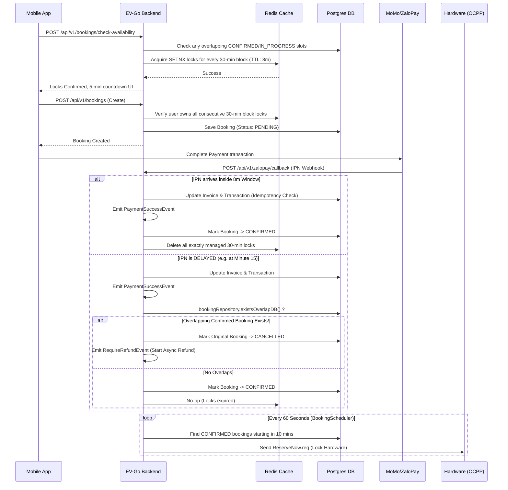

# Walkthrough: Booking Module

## 1. Description
The `booking` module handles the reservation of charging ports at stations. 

## 2. Dependencies
- `sharedkernel`: Common DTOs, Enums (`AvailabilityStatus`, `BookingStatus`), and Exceptions.
- `station`: Provides `PortCountProvider` to calculate total vs available ports.

## 3. Entities
### Booking
- `id`: Primary key
- `userId`: Identifier of the user booking
- `stationId`: The station where the booking takes place
- `portNumber`: Specific port reserved
- `startTime`, `endTime`: Duration of the booking
- `status`: BookingStatus (e.g. PENDING, CONFIRMED, IN_PROGRESS, COMPLETED)

## 4. Features & Operations Flow

### The 6-Phase Booking Lifecycle
1. **Search & Software Lock (Redis)** 
   - User selects time slot (e.g., 09:00 - 10:00).
   - Backend queries DB for availability, then creates a temporary Redis lock (8-min TTL) to prevent overlapping bookings. App shows 5 mins countdown.
2. **Payment & Confirmation**
   - User pays via MoMo/VNPay.
   - On SUCCESS webhook, backend saves to DB (bookings, invoices) and deletes Redis key. Slot is officially booked.
3. **Pre-arrival & OCPP Lock (T-10 mins before start)** 
   - `BookingScheduler` finds blocks starting in 10 mins (e.g. 08:50).
   - *Clear the station*: Checks for overstaying EV via OCPP and sends `RemoteStopTransaction.req` if another user is overstaying.
   - *ReserveNow*: Sends `ReserveNow.req` to the charge point. Port LED turns yellow/Reserved.
4. **Charging & Notification**
   - User arrives, plugs in, and charges.
   - At T-15 mins before end (e.g. 09:45), `BookingScheduler` sends a *Soft Warning* push notification: "5 mins left until power cut".
5. **Cut-off & Grace Period (T-10 mins before end)**
   - At T-10 mins (e.g. 09:50), `BookingScheduler` sends a *Hard Cut-off* (`RemoteStopTransaction.req`). Power is safely cut.
   - Push notification sent: "Power cut. You have 10 mins to move your bike before idle fees apply".
6. **Penalties & Resolution (End of Block)**
   - *Overstay*: At 10:00, if EV remains plugged in, idle fees begin.
   - *No-Show*: At 10:00, if user never arrived, `ReserveNow` naturally expires and port returns to `Available`. User forfeits payment.

### APIs & Schedulers
✅ **[NEW] Configurable durations**: Fetch list of valid charging durations in hours (1.0 to 12.0)
✅ **[NEW] Calendar Status & Available Slots**: Fetch availability and calculate available time slots minus existing bookings.
✅ **[NEW] Check Availability**: DB/Redis availability check and price estimation.
✅ **[NEW] Create & Cancel Booking**: Create PENDING bookings, cancel CONFIRMED bindings (> 2h before).
✅ **[NEW] Get Bookings by Status**: Retrieves paginated list of bookings.
✅ **[NEW] Payment Success Listener**: Updates booking status and deletes the Redis lock.
✅ **[NEW] Scheduler Job 1 (Redis Cleanup)**: Cleans stuck Redis lock keys every minute.
✅ **[NEW] Scheduler Job 2 (Pre-arrival Hardware Lock)**: At T-10 mins before booking start. Sends `RemoteStop` for overstays, then `ReserveNow` for arriving user.
✅ **[NEW] Scheduler Job 3 (Soft Warning)**: At T-15 mins before booking end. Sends push notification.
✅ **[NEW] Scheduler Job 4 (Hard Cut-off)**: At T-10 mins before booking end. Sends `RemoteStop` to cut power and sends Push Notification for moving the bike.
✅ **[NEW] StatusNotification DB Persistence**: OCPP `StatusNotification` logs port status to DB.

## 5. API Endpoints

| Method | Endpoint | Description | Auth | Role |
|--------|----------|-------------|------|------|
| `GET` | `/api/v1/config/durations` | Get list of charging durations | ❌ | ANY |
| `GET` | `/api/v1/bookings/calendar-status` | Get days in a month with availability status | ❌ | ANY |
| `GET` | `/api/v1/bookings/available-slots` | Calculates and returns available time slots | ❌ | ANY |
| `GET` | `/api/v1/bookings/{id}` | Get booking by ID | ✅ | ANY |
| `GET` | `/api/v1/bookings/user/{userId}` | Get bookings by user ID | ✅ | ANY |
| `GET` | `/api/v1/bookings/port/{portId}` | Get bookings by port ID | ✅ | ANY |
| `GET` | `/api/v1/bookings?status={status}&page={page}&size={size}` | Get bookings by status with pagination | ✅ | ANY |
| `POST` | `/api/v1/bookings/check-availability` | Check availability and create Redis lock (8 min) | ✅ | ANY |
| `POST` | `/api/v1/bookings` | Create a PENDING booking | ✅ | ANY |
| `POST` | `/api/v1/bookings/{id}/cancel` | Cancel a booking (> 2 hours before start time) | ✅ | ANY |

## 6. Testing
- `BookingMetadataServiceTest`: Covers unit tests for duration config, calendar status and available slots calculations.
- `BookingServiceTest`: Covers Redis locking mechanism and booking estimation (`preview`).
- `BookingEventListenerTest`: Verifies `PaymentSuccessEvent` listener logic (booking status update & Redis lock deletion).
- `BookingSchedulerTest`: Covers all 4 scheduler jobs (8 tests) — Redis cleanup, pre-arrival lock, soft warning, and hard cut-off.
- `ModularityTest`: Guarantees no illegal inter-module relationships.

## 7. Architecture & Constraints
- Calculating available slots factors in `PortCounts` from the `station` module to ensure we never overbook ports.
- The physical charger ports are locked via OCPP `ReserveNow` matching exactly the booking blocks.
- The Redis locking mechanism uses the consecutive key format `evgo:booking:lock:{stationId}:{portNumber}:{intervalStart}` mapped exactly per 30-min block with an 8-minute TTL.
- Scheduler jobs strictly use 1-minute time windows (e.g. `[now+9min, now+10min]`) to fire correctly and reliably.

## 8. Sequence Diagram: Robust Booking Flow

