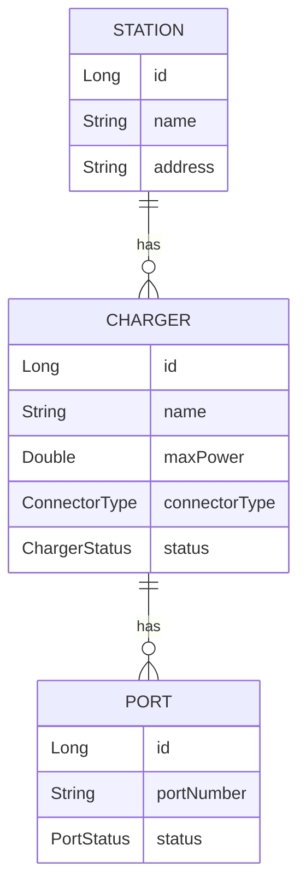
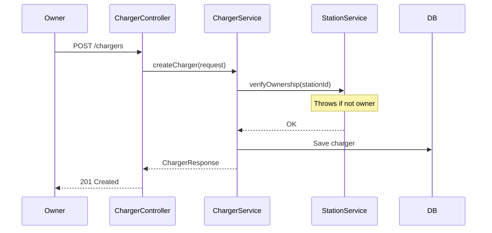
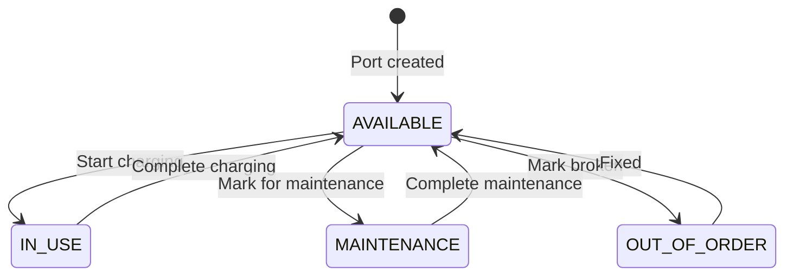

# Tài liệu Walkthrough - Charger Module

Module quản lý bộ sạc (Charger) và cổng sạc (Port), cho phép Station Owner cấu hình thiết bị sạc trong trạm.

---

## Tổng quan Module

| Thuộc tính | Giá trị |
|------------|---------|
| **Package** | `com.project.evgo.charger` |
| **Display Name** | Charger Management |
| **Số Services** | 1 (ChargerService) |
| **Số Controllers** | 1 (ChargerController) |

---

## Mô hình dữ liệu



---

## API Endpoints

### Charger APIs

| Method | Endpoint | Mô tả | Auth | Role |
|--------|----------|-------|------|------|
| `GET` | `/api/v1/chargers?stationId={id}` | Danh sách charger của station | ❌ | Public |
| `GET` | `/api/v1/chargers/{id}` | Chi tiết charger | ❌ | Public |
| `POST` | `/api/v1/chargers` | Tạo charger mới | ✅ | STATION_OWNER |
| `PUT` | `/api/v1/chargers/{id}` | Cập nhật charger | ✅ | STATION_OWNER |
| `DELETE` | `/api/v1/chargers/{id}` | Xóa charger | ✅ | STATION_OWNER |

### Port APIs

| Method | Endpoint | Mô tả | Auth | Role |
|--------|----------|-------|------|------|
| `GET` | `/api/v1/chargers/{id}/ports` | Danh sách port của charger | ❌ | Public |
| `GET` | `/api/v1/ports/{portId}` | Chi tiết port | ❌ | Public |
| `POST` | `/api/v1/chargers/{chargerId}/ports` | Tạo port mới | ✅ | STATION_OWNER |
| `PUT` | `/api/v1/ports/{portId}` | Cập nhật trạng thái port | ✅ | STATION_OWNER |
| `DELETE` | `/api/v1/ports/{portId}` | Xóa port | ✅ | STATION_OWNER |

---

## Service Interface

```java
public interface ChargerService {
    // Read operations (Public)
    List<ChargerResponse> findByStationId(Long stationId);
    Optional<ChargerResponse> findById(Long id);
    List<PortResponse> findPortsByChargerId(Long chargerId);
    Optional<PortResponse> findPortById(Long id);

    // Charger management (Owner only)
    ChargerResponse createCharger(CreateChargerRequest request);
    ChargerResponse updateCharger(Long id, String name, Double maxPower, ConnectorType connectorType);
    void deleteCharger(Long id);

    // Port management (Owner only)
    PortResponse createPort(CreatePortRequest request);
    PortResponse updatePortStatus(Long id, PortStatus status);
    void deletePort(Long id);
}
```

---

## Luồng xử lý chính

### Tạo Charger



### Cập nhật Port Status



---

## Các tính năng đã implement

### Public Features

- ✅ Xem danh sách charger theo station
- ✅ Xem chi tiết charger
- ✅ Xem danh sách port theo charger
- ✅ Xem chi tiết port

### Station Owner Features

- ✅ Thêm charger vào station
- ✅ Cập nhật thông tin charger (tên, công suất, loại connector)
- ✅ Xóa charger
- ✅ Thêm port vào charger
- ✅ Cập nhật trạng thái port
- ✅ Xóa port

### Cross-module Integration

- ✅ Sử dụng `StationService.verifyOwnership()` để kiểm tra quyền sở hữu

---

## Request/Response DTOs

### CreateChargerRequest

```java
public record CreateChargerRequest(
    @NotNull Long stationId,
    @NotBlank String name,
    @NotNull Double maxPower,
    @NotNull ConnectorType connectorType
) {}
```

### UpdateChargerRequest

```java
public record UpdateChargerRequest(
    String name,
    Double maxPower,
    ConnectorType connectorType
) {}
```

### ChargerResponse

```java
public record ChargerResponse(
    Long id,
    Long stationId,
    String name,
    Double maxPower,
    ConnectorType connectorType,
    ChargerStatus status,
    Integer totalPorts,
    Integer availablePorts,
    LocalDateTime createdAt,
    LocalDateTime updatedAt
) {}
```

> [!NOTE]
> **Ý nghĩa các trường đặc biệt:**
> - `totalPorts`: Tổng số cổng sạc của charger
> - `availablePorts`: Số cổng sạc đang Available (chưa có ai dùng)

### CreatePortRequest

```java
public record CreatePortRequest(
    @NotBlank String portNumber
) {}
```

### UpdatePortRequest

```java
public record UpdatePortRequest(
    @NotNull PortStatus status
) {}
```

### PortResponse

```java
public record PortResponse(
    Long id,
    Long chargerId,
    String portNumber,
    PortStatus status,
    LocalDateTime createdAt,
    LocalDateTime updatedAt
) {}
```

---

## Entities

### Charger Entity

```java
@Entity
@Table(name = "chargers")
public class Charger {
    @Id
    @GeneratedValue(strategy = GenerationType.IDENTITY)
    private Long id;

    @ManyToOne(fetch = FetchType.LAZY)
    @JoinColumn(name = "station_id", nullable = false)
    private Station station;

    @Column(nullable = false)
    private String name;

    @Column(nullable = false)
    private Double maxPower;

    @Enumerated(EnumType.STRING)
    @Column(nullable = false)
    private ConnectorType connectorType;

    @Enumerated(EnumType.STRING)
    @Column(nullable = false)
    private ChargerStatus status = ChargerStatus.ACTIVE;

    @OneToMany(mappedBy = "charger", cascade = CascadeType.ALL)
    private List<Port> ports = new ArrayList<>();

    @CreationTimestamp
    private LocalDateTime createdAt;

    @UpdateTimestamp
    private LocalDateTime updatedAt;
}
```

### Port Entity

```java
@Entity
@Table(name = "ports")
public class Port {
    @Id
    @GeneratedValue(strategy = GenerationType.IDENTITY)
    private Long id;

    @ManyToOne(fetch = FetchType.LAZY)
    @JoinColumn(name = "charger_id", nullable = false)
    private Charger charger;

    @Column(nullable = false)
    private String portNumber;

    @Enumerated(EnumType.STRING)
    @Column(nullable = false)
    private PortStatus status = PortStatus.AVAILABLE;

    @CreationTimestamp
    private LocalDateTime createdAt;

    @UpdateTimestamp
    private LocalDateTime updatedAt;
}
```

---

## Enums

### ConnectorType

```java
public enum ConnectorType {
    TYPE_1,         // J1772 (US Standard)
    TYPE_2,         // Mennekes (EU Standard)
    CCS1,           // Combined Charging System 1
    CCS2,           // Combined Charging System 2
    CHADEMO,        // Japanese DC fast charging
    TESLA,          // Tesla proprietary
    GB_T            // Chinese standard
}
```

| Value | Mô tả | Thị trường |
|-------|-------|------------|
| `TYPE_1` | J1772 | Mỹ, Nhật |
| `TYPE_2` | Mennekes | Châu Âu |
| `CCS1` | Combined Charging System 1 | Mỹ |
| `CCS2` | Combined Charging System 2 | Châu Âu |
| `CHADEMO` | DC fast charging | Nhật |
| `TESLA` | Tesla proprietary | Toàn cầu (Tesla) |
| `GB_T` | Chinese standard | Trung Quốc |

### ChargerStatus

```java
public enum ChargerStatus {
    ACTIVE,         // Đang hoạt động
    INACTIVE,       // Không hoạt động
    MAINTENANCE     // Đang bảo trì
}
```

| Status | Mô tả | Hiển thị cho User |
|--------|-------|-------------------|
| `ACTIVE` | Đang hoạt động | ✅ Có |
| `INACTIVE` | Tạm ngưng | ❌ Không |
| `MAINTENANCE` | Đang bảo trì | ⚠️ Có (với badge) |

### PortStatus

```java
public enum PortStatus {
    AVAILABLE,      // Sẵn sàng
    IN_USE,         // Đang sạc
    MAINTENANCE,    // Đang bảo trì
    OUT_OF_ORDER    // Hỏng
}
```

| Status | Mô tả | Cho phép Booking |
|--------|-------|------------------|
| `AVAILABLE` | Sẵn sàng sử dụng | ✅ Có |
| `IN_USE` | Đang có người sạc | ❌ Không |
| `MAINTENANCE` | Đang bảo trì | ❌ Không |
| `OUT_OF_ORDER` | Hỏng | ❌ Không |

---

## File Structure

```
charger/
├── package-info.java              # @ApplicationModule
├── ChargerService.java            # Public service interface
├── request/
│   ├── CreateChargerRequest.java
│   ├── UpdateChargerRequest.java
│   ├── CreatePortRequest.java
│   └── UpdatePortRequest.java
├── response/
│   ├── ChargerResponse.java
│   └── PortResponse.java
└── internal/
    ├── Charger.java               # Entity
    ├── Port.java                  # Entity
    ├── ChargerRepository.java
    ├── PortRepository.java
    ├── ChargerDtoConverter.java
    ├── ChargerServiceImpl.java
    └── web/
        └── ChargerController.java
```

---

## Dependencies

Module `charger` phụ thuộc vào:
- `sharedkernel` - DTOs, Enums, Exceptions
- `station` - Để xác minh quyền sở hữu station trước khi thêm/xóa charger

Module `charger` được sử dụng bởi:
- `booking` - Để kiểm tra port khả dụng
- `charging` - Để quản lý phiên sạc

---

## Lưu ý quan trọng

1. **Ownership Cascade**: Khi thêm charger vào station, hệ thống tự động kiểm tra quyền sở hữu station thông qua `StationService.verifyOwnership()`.

2. **Port Counting**: `ChargerResponse` bao gồm `totalPorts` và `availablePorts` để mobile app hiển thị số cổng khả dụng.

3. **Status Management**: Port status được quản lý độc lập, cho phép đánh dấu bảo trì hoặc hỏng mà không ảnh hưởng đến charger khác.
