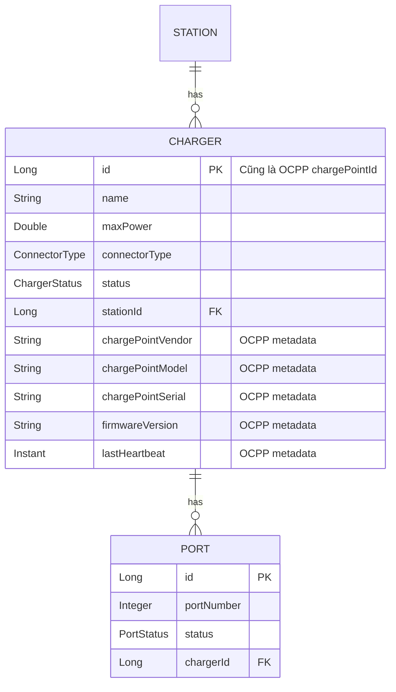
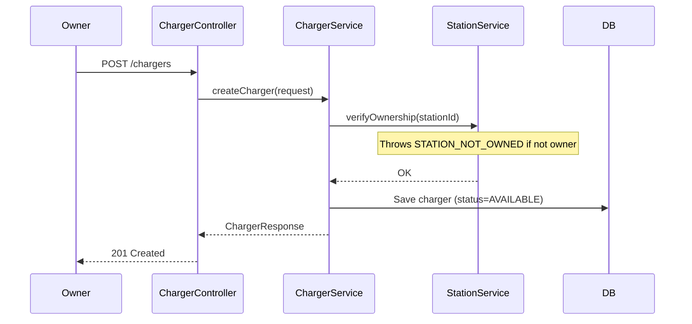
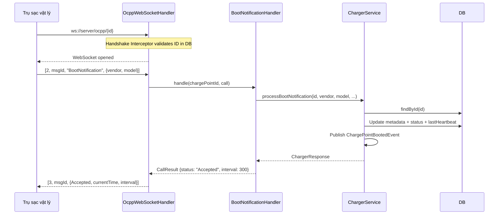
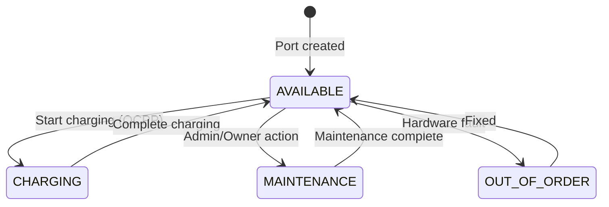

# Tài liệu Walkthrough - Charger Module

Module quản lý bộ sạc (Charger) và cổng sạc (Port), đồng thời cung cấp API nội bộ cho OCPP module để xử lý BootNotification và Heartbeat.

---

## Tổng quan Module

| Thuộc tính | Giá trị |
|------------|---------|
| **Package** | `com.project.evgo.charger` |
| **Display Name** | Charger Management |
| **Số Services** | 1 (ChargerService) |
| **Số Controllers** | 1 (ChargerController) |

---

## Mô hình dữ liệu



> [!IMPORTANT]
> **Charger ID = OCPP chargePointId.** Trụ sạc vật lý kết nối qua `ws://server/ocpp/{chargerId}`. Không có field `ocppIdentity` riêng — dùng database ID trực tiếp.

---

## API Endpoints

### Charger APIs

| Method | Endpoint | Mô tả | Auth | Role |
|--------|----------|-------|------|------|
| `GET` | `/api/v1/chargers?stationId={id}` | Danh sách charger của station | ❌ | Public |
| `GET` | `/api/v1/chargers/{id}` | Chi tiết charger (bao gồm OCPP metadata) | ❌ | Public |
| `POST` | `/api/v1/chargers` | Tạo charger mới | ✅ | STATION_OWNER |
| `PUT` | `/api/v1/chargers/{id}` | Cập nhật charger | ✅ | STATION_OWNER |
| `DELETE` | `/api/v1/chargers/{id}` | Xóa charger | ✅ | STATION_OWNER |

### Port APIs

| Method | Endpoint | Mô tả | Auth | Role |
|--------|----------|-------|------|------|
| `GET` | `/api/v1/chargers/{id}/ports` | Danh sách port của charger | ❌ | Public |
| `GET` | `/api/v1/ports/{portId}` | Chi tiết port | ❌ | Public |
| `POST` | `/api/v1/chargers/{chargerId}/ports` | Tạo port mới | ✅ | STATION_OWNER |
| `PATCH` | `/api/v1/chargers/ports/{portId}/status` | Cập nhật trạng thái port | ✅ | STATION_OWNER |
| `DELETE` | `/api/v1/chargers/ports/{portId}` | Xóa port | ✅ | STATION_OWNER |

---

## Service Interface

```java
public interface ChargerService {
    // Read operations (Public)
    List<ChargerResponse> findByStationId(Long stationId);
    Optional<ChargerResponse> findById(Long id);
    List<PortResponse> findPortsByChargerId(Long chargerId);
    Optional<PortResponse> findPortById(Long id);

    // Charger management (Owner only)
    ChargerResponse createCharger(CreateChargerRequest request);
    ChargerResponse updateCharger(Long id, UpdateChargerRequest request);
    void deleteCharger(Long id);

    // Port management (Owner only)
    PortResponse createPort(Long chargerId, CreatePortRequest request);
    PortResponse updatePortStatus(Long id, PortStatus status);
    void deletePort(Long id);

    // Statistics (Station module uses this for ChargerSummary)
    List<ChargerStatisticProjection> findStatisticsByStationId(Long stationId);

    // OCPP operations (called by OCPP module handlers)
    Optional<ChargerResponse> processBootNotification(
            Long chargerId, String vendor, String model, String serial, String firmware);
    void updateHeartbeat(Long chargerId);
}
```

---

## Luồng xử lý chính

### Tạo Charger



### OCPP BootNotification (cross-module)



### Port Status State Machine



---

## Request/Response DTOs

### CreateChargerRequest

```java
@Data @NoArgsConstructor @AllArgsConstructor
public class CreateChargerRequest {
    @NotBlank String name;
    @NotNull @Positive Double maxPower;
    @NotNull Long stationId;
    @NotNull ConnectorType connectorType;
}
```

### UpdateChargerRequest

```java
public record UpdateChargerRequest(
    @NotBlank String name,
    @NotNull @Positive Double maxPower,
    @NotNull ConnectorType connectorType
) {}
```

### ChargerResponse

```java
@Data @Builder
public class ChargerResponse {
    Long id;
    String name;
    Double maxPower;
    ConnectorType connectorType;
    ChargerStatus status;
    Long stationId;
    List<PortResponse> ports;
    Integer totalPorts;
    Integer availablePorts;

    // OCPP metadata (populated after BootNotification)
    String chargePointVendor;
    String chargePointModel;
    String chargePointSerial;
    String firmwareVersion;
    Instant lastHeartbeat;

    LocalDateTime createdAt;
}
```

> [!NOTE]
> - `totalPorts`: Tổng số cổng sạc của charger
> - `availablePorts`: Số cổng sạc đang AVAILABLE
> - OCPP metadata fields sẽ là `null` cho đến khi trụ sạc vật lý kết nối và gửi BootNotification

### CreatePortRequest / PortResponse

```java
public record CreatePortRequest(@NotNull Integer portNumber) {}

@Data @Builder
public class PortResponse {
    Long id;
    Integer portNumber;
    PortStatus status;
    Long chargerId;
    LocalDateTime createdAt;
}
```

---

## Enums

### ChargerStatus (Aligned with OCPP 1.6)

```java
public enum ChargerStatus {
    AVAILABLE,       // Sẵn sàng nhận giao dịch mới
    PREPARING,       // Đã cắm connector, chưa sạc
    CHARGING,        // Đang sạc
    SUSPENDED_EVSE,  // Trụ tạm dừng cấp điện
    SUSPENDED_EV,    // Xe tạm dừng nhận điện
    FINISHING,       // Xong giao dịch, cáp chưa rút
    RESERVED,        // Đã đặt trước cho user cụ thể
    UNAVAILABLE,     // Bảo trì hoặc admin tắt
    FAULTED,         // Lỗi phần cứng
    OFFLINE          // Internal: mất kết nối WebSocket
}
```

### ConnectorType (Thị trường Việt Nam)

| Value | Mô tả |
|-------|-------|
| `SOCKET_220V` | Ổ cắm thường 220V |
| `VINFAST_STD` | Chuẩn VinFast |
| `DATBIKE_FAST` | Sạc nhanh Dat Bike |
| `IEC_TYPE_2` | Chuẩn Type 2 quốc tế |
| `OTHER` | Loại khác |

### PortStatus (Aligned with OCPP 1.6)

| Status | Mô tả | Cho phép Booking |
|--------|-------|------------------|
| `AVAILABLE` | Sẵn sàng nhận giao dịch | ✅ |
| `PREPARING` | Đã cắm connector, chưa sạc | ❌ |
| `CHARGING` | Đang sạc | ❌ |
| `SUSPENDED_EVSE` | Trụ tạm dừng cấp điện | ❌ |
| `SUSPENDED_EV` | Xe tạm dừng nhận điện | ❌ |
| `FINISHING` | Xong giao dịch, cáp chưa rút | ❌ |
| `RESERVED` | Đã đặt trước | ❌ |
| `UNAVAILABLE` | Bảo trì / admin tắt | ❌ |
| `FAULTED` | Lỗi phần cứng | ❌ |

---

## Charger Entity

```java
@Entity
@Table(name = "chargers")
public class Charger {
    @Id @GeneratedValue(strategy = GenerationType.IDENTITY)
    private Long id;                    // = OCPP chargePointId

    private String name;
    private Double maxPower;

    @Enumerated(EnumType.STRING)
    private ConnectorType connectorType;

    @Enumerated(EnumType.STRING)
    private ChargerStatus status = ChargerStatus.AVAILABLE;

    @Column(name = "station_id")
    private Long stationId;             // FK, không dùng @ManyToOne

    // OCPP Metadata (populated by BootNotification)
    private String chargePointVendor;
    private String chargePointModel;
    private String chargePointSerial;
    private String firmwareVersion;
    private Instant lastHeartbeat;

    @OneToMany(mappedBy = "charger", cascade = CascadeType.ALL, orphanRemoval = true)
    private List<Port> ports;

    private LocalDateTime createdAt;    // @CreationTimestamp
    private LocalDateTime updatedAt;    // @UpdateTimestamp
}
```

> [!NOTE]
> `stationId` lưu dưới dạng `Long` thay vì quan hệ `@ManyToOne` để tuân thủ Spring Modulith — module `charger` không được import entity `Station` trực tiếp. Thay vào đó, module gọi `StationService.verifyOwnership()` qua public API.

---

## File Structure

```
charger/
├── package-info.java                # @ApplicationModule, depends on sharedkernel + station
├── ChargerService.java              # Public service interface
├── ChargePointBootedEvent.java      # Spring event: record(Long chargerId)
├── request/
│   ├── CreateChargerRequest.java
│   ├── UpdateChargerRequest.java    # record
│   ├── CreatePortRequest.java       # record
│   └── UpdatePortRequest.java       # record
├── response/
│   ├── ChargerResponse.java         # Includes OCPP metadata
│   └── PortResponse.java
└── internal/
    ├── Charger.java                 # Entity (with OCPP metadata)
    ├── Port.java                    # Entity
    ├── ChargerRepository.java
    ├── PortRepository.java
    ├── ChargerStatisticProjection.java  # Projection for station summary
    ├── ChargerDtoConverter.java
    ├── ChargerServiceImpl.java      # Includes OCPP methods + event publishing
    └── web/
        └── ChargerController.java
```

---

## Dependencies

```
charger → sharedkernel (Enums, Exceptions, DTOs)
charger → station      (StationService.verifyOwnership())

ocpp    → charger      (ChargerService: processBootNotification, updateHeartbeat, findById)
station → charger      (ChargerService: findStatisticsByStationId — causes circular dep ⚠️)
```

> [!WARNING]
> **Circular Dependency:** `station` → `charger` (for statistics) và `charger` → `station` (for ownership). Hiện tại dùng `@Lazy` để tránh khởi tạo vòng. Cần refactor trong tương lai (ví dụ dùng Spring Events hoặc tách statistics ra module riêng).

---

## Lưu ý quan trọng

1. **Ownership Cascade**: Mọi thao tác ghi (create/update/delete) đều phải qua `StationService.verifyOwnership()`. Nếu không phải owner → `CHARGER_NOT_OWNED` (403).

2. **OCPP Integration**: Module `charger` cung cấp `processBootNotification()` và `updateHeartbeat()` cho module `ocpp`. Khi BootNotification thành công, hệ thống publish `ChargePointBootedEvent` qua Spring's `ApplicationEventPublisher`.

3. **Handshake Validation**: `OcppHandshakeInterceptor` gọi `ChargerService.findById()` khi trụ sạc xin mở WebSocket. ID không tồn tại → reject kết nối ngay.

4. **Port Counting**: `ChargerResponse` tự tính `totalPorts` và `availablePorts` trong `ChargerDtoConverter`.

5. **Statistics Projection**: `ChargerStatisticProjection` cung cấp dữ liệu `GROUP BY connectorType, status` cho Station module hiển thị `ChargerSummary`.
