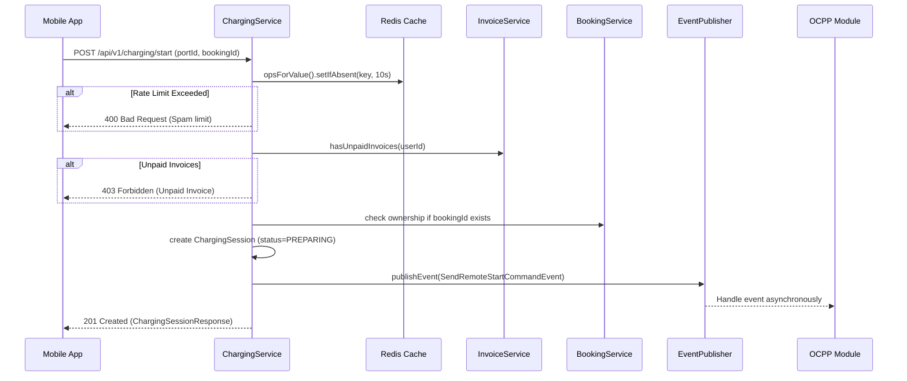
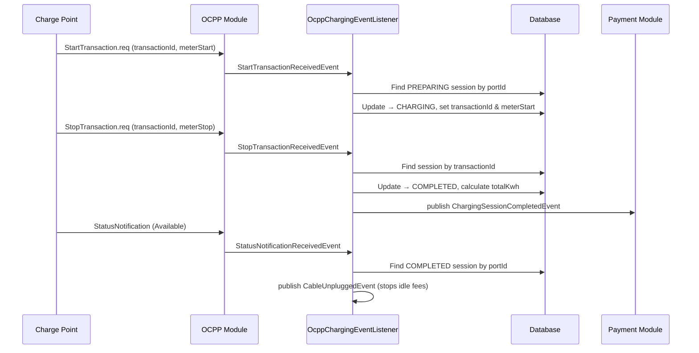

# Walkthrough: Charging Module

## 1. Overview
The **Charging Module** is responsible for managing the full lifecycle of an EV charging session. This encompasses starting/stopping a session from the mobile app (or via an active booking), preventing API abuse or spam requests, communicating with the `InvoiceService` to enforce debt checks, publishing system events to trigger remote OCPP actions, and **listening to OCPP callback events** to sync real-time charger state into the database.

## 2. Implemented Features
- ✅ **[NEW]** Start a charging session checking Redis limits, invalid debts, and proper booking ownership.
- ✅ **[NEW]** Stop an active charging session via User command.
- ✅ **[NEW]** Real-time Monitoring via Server-Sent Events (SSE) for frontend meter values and estimated cost updates.
- ✅ **[NEW]** Send cross-domain loosely-coupled Application Events (`SendRemoteStartCommandEvent`, `SendRemoteStopCommandEvent`) that the `OCPP` module can listen to.
- ✅ **[NEW]** `OcppChargingEventListener` — Sync charger state via OCPP callbacks:
  - Listen to `StartTransactionReceivedEvent` → update session to `CHARGING` with `transactionId` and `meterStart`.
  - Listen to `StopTransactionReceivedEvent` → complete session, calculate `totalKwh`, publish `ChargingSessionCompletedEvent`.
  - Listen to `StatusNotificationReceivedEvent` → detect cable unplug (`Available`/`Finishing`), publish `CableUnpluggedEvent`.

## 3. Entity
### `ChargingSession`
| Field | Type | Description |
|-------|------|-------------|
| `id` | Long | Primary key |
| `userId` | Long | Owner of the session |
| `portId` | Long | FK to port (connector) |
| `bookingId` | Long | Optional FK to booking |
| `invoiceId` | Long | Optional FK to invoice |
| `transactionId` | Integer | OCPP transaction ID |
| `meterStart` | Integer | Meter reading (Wh) at transaction start |
| `startTime` | LocalDateTime | When charging actually began |
| `endTime` | LocalDateTime | When charging completed |
| `totalKwh` | BigDecimal | Calculated energy: `(meterStop - meterStart) / 1000` |
| `status` | ChargingSessionStatus | PREPARING → CHARGING → COMPLETED → FINISHING |
| `createdAt` | LocalDateTime | Auto-generated |
| `updatedAt` | LocalDateTime | Auto-generated |

## 4. API Endpoints

| Method | Endpoint | Description | Auth | Role |
|--------|----------|-------------|------|------|
| `POST` | `/api/v1/charging/start` | Start a charging session for a port | ✅ | `USER` |
| `POST` | `/api/v1/charging/stop` | Stop charging session by ID | ✅ | `USER` |
| `GET`  | `/api/v1/charging/sessions/{id}/monitor-stream` | Subscribe to real-time charging metrics (SSE) | ✅ | `USER` |

## 4.1. SSE Real-Time Monitoring (For Frontend)
The frontend should connect to the `monitor-stream` endpoint using an `EventSource` (or polyfill for custom auth headers) to receive real-time UI updates while the user is charging. The backend prevents unnecessary polling by pushing data only when meter values are received from hardware.

### SSE Event Types

#### Event: `meter-update`
Pushed periodically while the session is active.
```json
{
  "status": "CHARGING",
  "consumedKwh": 12.4500,
  "estimatedCost": 45000,
  "currentMeterValue": 1012450,
  "chargingRatePerKwh": 3614,
  "timestamp": "2026-04-14T02:00:00"
}
```

#### Event: `session-ended`
Pushed exactly once when the session halts (status moves to FINISHING, COMPLETED, INTERRUPTED, etc.). The connection is automatically closed by the backend right after this event.
```json
{
  "status": "FINISHING",
  "consumedKwh": 12.4500,
  "estimatedCost": 45000,
  "currentMeterValue": null,
  "timestamp": "2026-04-14T02:15:00"
}
```

> [!TIP]
> Standard SSE handles network drops via silent reconnects. The backend caches session pricing, so reconnecting is fast and efficient. Ensure the current `userId` matches the session owner or you'll get a 403 Forbidden.

## 5. Application Events

### Events Published by Charging Module
| Event | Payload | When |
|-------|---------|------|
| `SendRemoteStartCommandEvent` | `sessionId` | User starts charging → OCPP module sends RemoteStartTransaction |
| `SendRemoteStopCommandEvent` | `sessionId` | User stops charging → OCPP module sends RemoteStopTransaction |
| `ChargingSessionCompletedEvent` | `sessionId, userId, portId, totalKwh` | StopTransaction received → session completed |
| `CableUnpluggedEvent` | `sessionId, portId` | StatusNotification Available/Finishing → stops idle fees |

### Events Consumed by Charging Module (from OCPP)
| Event | Source | Key Payload (OCPP 1.6 spec) | Handler |
|-------|--------|----------------------------|---------|
| `StartTransactionReceivedEvent` | `ocpp` | `chargePointId, connectorId, portId, transactionId, idTag, meterStart, timestamp, reservationId` | `OcppChargingEventListener.onStartTransaction()` |
| `StopTransactionReceivedEvent` | `ocpp` | `transactionId, meterStop, timestamp, idTag, reason` | `OcppChargingEventListener.onStopTransaction()` |
| `StatusNotificationReceivedEvent` | `ocpp` | `chargePointId, connectorId, portId, errorCode, status, info, timestamp, vendorErrorCode, vendorId` | `OcppChargingEventListener.onStatusNotification()` |

## 6. Sequence Diagram — Start Charging (Mobile App)



## 7. Sequence Diagram — OCPP Callback Sync



## 8. Dependencies
- **Booking**: `BookingService` (read booking ownership), `booking/response` NamedInterface
- **Payment**: `InvoiceService.hasUnpaidInvoices()` for debt blocking
- **OCPP**: Consumes 3 events from `ocpp` module root (StartTransaction, StopTransaction, StatusNotification)
- **Shared Kernel**: `ChargingSessionStatus`, `ErrorCode`, `AppException`
