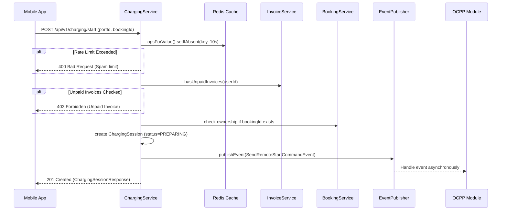

# Walkthrough: Charging Module

## 1. Overview
The **Charging Module** is responsible for managing the lifecycle of an EV charging session. This encompasses starting/stopping a session from the mobile app (or via an active booking), preventing API abuse or spam requests, communicating with the `InvoiceService` to enforce debt checks, and publishing system events to trigger remote OCPP actions.

## 2. Implemented Features
- ✅ **[NEW]** Start a charging session checking Redis limits, invalid debts, and proper booking ownership.
- ✅ **[NEW]** Stop an active charging session via User command.
- ✅ **[NEW]** Send cross-domain loosely-coupled Application Events (`SendRemoteStartCommandEvent`, `SendRemoteStopCommandEvent`) that the `OCPP` module can listen to.

## 3. Entity Changes
### `ChargingSession`
Stores session state and ties the session to User ID, Port ID, Booking ID, Transaction ID (from OCPP), logic timestamps, total energy consumption, and the related generated Payment Invoice.

## 4. API Endpoints

| Method | Endpoint | Description | Auth | Role |
|--------|----------|-------------|------|------|
| `POST` | `/api/v1/charging/start` | Start a charging session for a port | ✅ | `USER` |
| `POST` | `/api/v1/charging/stop` | Prevent/Stop charging session by ID | ✅ | `USER` |

## 5. Sequence Diagram

## 6. Dependencies Updated
- **Booking**: Added `booking/request` and `booking/response` explicit package-info to satisfy Spring Modulith boundaries.
- **Payment**: `InvoiceService` now exposes a synchronous `hasUnpaidInvoices()` method to securely enforce debt blocking.
