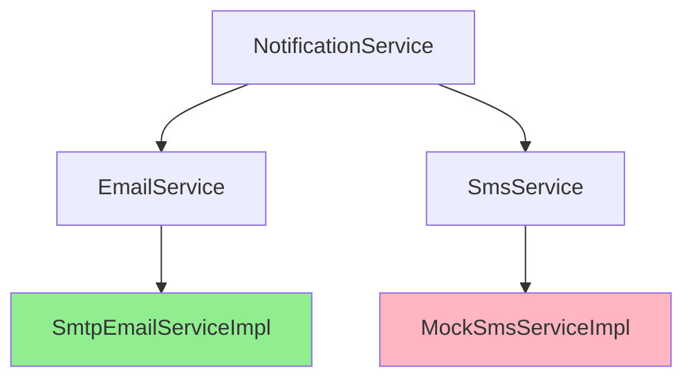

# Tài liệu Walkthrough - Notification Module

Module quản lý thông báo, cung cấp các chức năng gửi email và SMS cho người dùng.

---

## Tổng quan Module

| Thuộc tính | Giá trị |
|------------|---------|
| **Package** | `com.project.evgo.notification` |
| **Display Name** | Notification |
| **Số Services** | 3 (NotificationService, EmailService, SmsService) |
| **Số Controllers** | 1 (NotificationController) |

---

## Services Overview



| Service | Implementation | Status |
|---------|----------------|--------|
| NotificationService | NotificationServiceImpl | ✅ Production |
| EmailService | SmtpEmailServiceImpl | ✅ Production |
| SmsService | MockSmsServiceImpl | ⚠️ Mock (development) |

---

## API Endpoints

| Method | Endpoint | Mô tả | Auth |
|--------|----------|-------|------|
| `GET` | `/api/v1/notifications/{id}` | Lấy thông báo theo ID | ✅ |
| `GET` | `/api/v1/notifications/user/{userId}` | Danh sách thông báo của user | ✅ |
| `GET` | `/api/v1/notifications/user/{userId}/unread` | Danh sách thông báo chưa đọc | ✅ |
| `GET` | `/api/v1/notifications/user/{userId}/unread/count` | Đếm thông báo chưa đọc | ✅ |

---

## Service Interfaces

### NotificationService

```java
public interface NotificationService {
    Optional<NotificationResponse> findById(Long id);
    List<NotificationResponse> findByUserId(Long userId);
    List<NotificationResponse> findUnreadByUserId(Long userId);
    Long countUnreadByUserId(Long userId);
}
```

### EmailService

```java
public interface EmailService {
    // Gửi email xác minh tài khoản
    void sendVerificationEmail(String to, String fullName, String verificationToken);

    // Gửi email đặt lại mật khẩu
    void sendPasswordResetEmail(String to, String fullName, String resetToken);

    // Gửi email chào mừng
    void sendWelcomeEmail(String to, String fullName);

    // Gửi email thông báo duyệt Station Owner
    void sendApprovalEmail(String to, String businessName, String trackingId);

    // Gửi email thông báo từ chối Station Owner
    void sendRejectionEmail(String to, String businessName, String reason);
}
```

### SmsService

```java
public interface SmsService {
    void sendVerificationSms(String phoneNumber, String otpCode);
    void sendPasswordResetSms(String phoneNumber, String otpCode);
}
```

---

## Email Templates

### Verification Email

```html
Subject: Xác minh tài khoản EV-Go

Xin chào {fullName},

Cảm ơn bạn đã đăng ký tài khoản tại EV-Go.
Vui lòng click vào link bên dưới để xác minh email:

{verificationLink}

Link này sẽ hết hạn sau 24 giờ.
```

### Password Reset Email

```html
Subject: Đặt lại mật khẩu EV-Go

Xin chào {fullName},

Bạn đã yêu cầu đặt lại mật khẩu.
Vui lòng click vào link bên dưới:

{resetLink}

Link này sẽ hết hạn sau 1 giờ.
```

### Station Owner Approval Email

```html
Subject: Chúc mừng! Hồ sơ đăng ký của bạn đã được duyệt

Xin chào,

Hồ sơ đăng ký Station Owner cho "{businessName}" đã được duyệt.

Mã theo dõi: {trackingId}

Bạn có thể đăng nhập và bắt đầu thêm trạm sạc.
```

### Station Owner Rejection Email

```html
Subject: Thông báo về hồ sơ đăng ký

Xin chào,

Hồ sơ đăng ký Station Owner cho "{businessName}" không được chấp thuận.

Lý do: {reason}

Vui lòng liên hệ support nếu cần hỗ trợ thêm.
```

---

## Các tính năng đã implement

### NotificationService

- ✅ Lưu trữ thông báo trong database
- ✅ Truy vấn thông báo theo user
- ✅ Đánh dấu đã đọc/chưa đọc
- ✅ Đếm thông báo chưa đọc

### EmailService (SMTP)

- ✅ Gửi email qua SMTP (Gmail, custom SMTP)
- ✅ Email xác minh tài khoản với link
- ✅ Email đặt lại mật khẩu với link
- ✅ Email chào mừng sau khi xác minh
- ✅ Email thông báo duyệt/từ chối Station Owner
- ✅ Async email sending (non-blocking)
- ✅ HTML email templates

### SmsService (Mock)

- ⚠️ Mock implementation cho development
- ⚠️ Log OTP ra console thay vì gửi thật
- 📝 Cần tích hợp Twilio/Nexmo cho production

---

## Entity

### Notification Entity

```java
@Entity
@Table(name = "notifications")
public class Notification {
    @Id
    @GeneratedValue(strategy = GenerationType.IDENTITY)
    private Long id;

    @ManyToOne(fetch = FetchType.LAZY)
    @JoinColumn(name = "user_id", nullable = false)
    private User user;

    @Column(nullable = false)
    private String title;

    @Column(length = 1000)
    private String message;

    @Enumerated(EnumType.STRING)
    @Column(nullable = false)
    private NotificationType type;

    private boolean isRead = false;

    @CreationTimestamp
    private LocalDateTime createdAt;
}
```

---

## Enums

### NotificationType

```java
public enum NotificationType {
    BOOKING,        // Thông báo đặt lịch
    CHARGING,       // Thông báo sạc
    PAYMENT,        // Thông báo thanh toán
    SYSTEM,         // Thông báo hệ thống
    PROMOTION       // Thông báo khuyến mãi
}
```

---

## Configuration

### SMTP Configuration (application.properties)

```properties
# Email SMTP Configuration
spring.mail.host=${MAIL_HOST:smtp.gmail.com}
spring.mail.port=${MAIL_PORT:587}
spring.mail.username=${MAIL_USERNAME}
spring.mail.password=${MAIL_PASSWORD}
spring.mail.properties.mail.smtp.auth=true
spring.mail.properties.mail.smtp.starttls.enable=true

# Application URLs (for email links)
app.frontend.url=${FRONTEND_URL:http://localhost:8081}
app.verification.expiry-hours=24
app.password-reset.expiry-hours=1
```

---

## File Structure

```
notification/
├── package-info.java              # @ApplicationModule
├── NotificationService.java       # Public service interface
├── EmailService.java              # Public service interface
├── SmsService.java                # Public service interface
├── request/
│   └── SendNotificationRequest.java
├── response/
│   └── NotificationResponse.java
└── internal/
    ├── Notification.java          # Entity
    ├── NotificationRepository.java
    ├── NotificationDtoConverter.java
    ├── NotificationServiceImpl.java
    ├── SmtpEmailServiceImpl.java  # Production email
    ├── MockSmsServiceImpl.java    # Mock SMS
    └── web/
        └── NotificationController.java
```

---

## Dependencies

Module `notification` phụ thuộc vào:
- `sharedkernel` - DTOs, Enums, Exceptions

Module `notification` được sử dụng bởi:
- `user` - Gửi email xác minh, welcome, password reset
- `booking` - Gửi thông báo đặt lịch (future)
- `charging` - Gửi thông báo khi sạc xong (future)
- `payment` - Gửi thông báo thanh toán (future)

---

## Async Email

Email được gửi bất đồng bộ để không block request chính:

```java
@Service
@Slf4j
public class SmtpEmailServiceImpl implements EmailService {

    @Async
    @Override
    public void sendVerificationEmail(String to, String fullName, String token) {
        try {
            // Build and send email
            MimeMessage message = buildVerificationEmail(to, fullName, token);
            mailSender.send(message);
            log.info("Verification email sent to: {}", to);
        } catch (Exception e) {
            log.error("Failed to send verification email to: {}", to, e);
        }
    }
}
```

---

## Lưu ý quan trọng

1. **Mock SMS**: Hiện tại SMS service là mock, OTP được log ra console. Cần tích hợp Twilio/Nexmo cho production.

2. **Email Links**: Link trong email sử dụng `app.frontend.url` để trỏ về mobile app hoặc web app.

3. **Async Processing**: Email gửi async nên không ảnh hưởng đến response time của API chính.

4. **Email Templates**: Templates được build trong code, có thể cải thiện bằng Thymeleaf hoặc FreeMarker.
