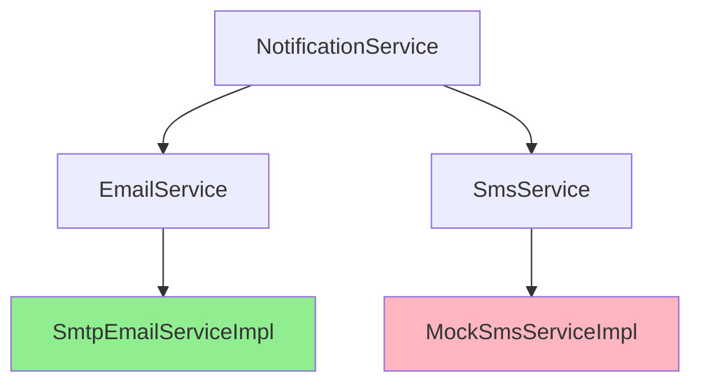
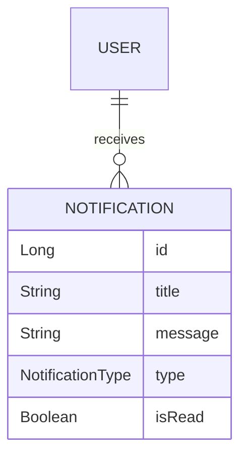

# Tài liệu Walkthrough - Notification Module

Module quản lý thông báo, cung cấp các chức năng gửi email và SMS cho người dùng.

---

## Tổng quan Module

| Thuộc tính | Giá trị |
|------------|---------|
| **Package** | `com.project.evgo.notification` |
| **Display Name** | Notification |
| **Số Services** | 3 (NotificationService, EmailService, SmsService) |
| **Số Controllers** | 1 (NotificationController) |

---

## Services Overview



| Service | Implementation | Status |
|---------|----------------|--------|
| NotificationService | NotificationServiceImpl | ✅ Production |
| EmailService | SmtpEmailServiceImpl | ✅ Production |
| SmsService | MockSmsServiceImpl | ⚠️ Mock (development) |

---

## Mô hình dữ liệu



---

## API Endpoints

| Method | Endpoint | Mô tả | Auth |
|--------|----------|-------|------|
| `GET` | `/api/v1/notifications/{id}` | Lấy thông báo theo ID | ✅ |
| `GET` | `/api/v1/notifications/user/{userId}` | Danh sách thông báo của user | ✅ |
| `GET` | `/api/v1/notifications/user/{userId}/unread` | Danh sách thông báo chưa đọc | ✅ |
| `GET` | `/api/v1/notifications/user/{userId}/unread/count` | Đếm thông báo chưa đọc | ✅ |

---

## Service Interfaces

### NotificationService

```java
public interface NotificationService {
    Optional<NotificationResponse> findById(Long id);
    List<NotificationResponse> findByUserId(Long userId);
    List<NotificationResponse> findUnreadByUserId(Long userId);
    Long countUnreadByUserId(Long userId);
}
```

### EmailService

```java
public interface EmailService {
    // Gửi email xác minh tài khoản (OTP)
    void sendVerificationEmail(String email, String otp);

    // Gửi email đặt lại mật khẩu (OTP)
    void sendPasswordResetEmail(String email, String otp);

    // Gửi email thông báo duyệt Station Owner kèm mật khẩu tạm
    void sendApprovalEmailWithPassword(String email, String fullName, String password);

    // Gửi email thông báo từ chối Station Owner
    void sendRejectionEmail(String email, String rejectionReason);
}
```

### SmsService

```java
public interface SmsService {
    // Gửi OTP xác minh số điện thoại
    void sendVerificationOtp(String phoneNumber, String otp);
    
    // Gửi OTP đặt lại mật khẩu
    void sendPasswordResetOtp(String phoneNumber, String otp);
}
```

---

## Email Templates

Hệ thống sử dụng các template HTML được xây dựng trực tiếp trong `SmtpEmailServiceImpl` với thiết kế giao diện hiện đại (chứa logo, màu sắc thương hiệu, cảnh báo bảo mật).

### Verification Email (Xác minh OTP)

- **Tiêu đề:** `{appName} - Verify Your Email`
- **Nội dung chính:** Cung cấp mã OTP có hiệu lực trong 30 phút. Nền OTP nổi bật:
  > "Please use the following OTP code to verify your email address: **[ 1 2 3 4 5 6 ]**"

### Password Reset Email (Khôi phục mật khẩu OTP)

- **Tiêu đề:** `{appName} - Reset Your Password`
- **Nội dung chính:** Cung cấp mã OTP để đặt lại mật khẩu. Hiệu lực 30 phút.
  > "We received a request to reset your password. Use the following OTP code: **[ 6 5 4 3 2 1 ]**"

### Station Owner Approval Email

- **Tiêu đề:** `{appName} - Registration Approved`
- **Nội dung chính:** Thông báo hồ sơ duyệt kèm theo mật khẩu tạm thời.
  > "Hello, {fullName}! We are pleased to inform you that your Station Owner profile has been reviewed and approved... **Temporary Password: [ password123 ]**"
- **Lưu ý:** Có dặn dò người dùng đổi mật khẩu ở lần đăng nhập đầu tiên.

### Station Owner Rejection Email

- **Tiêu đề:** `{appName} - Registration Rejected`
- **Nội dung chính:** Thông báo hồ sơ bị từ chối kèm lý do.
  > "Unfortunately, your station owner registration has been rejected. **Reason for Rejection:** {rejectionReason}"

---

## Các tính năng đã implement

### NotificationService

- ✅ Lưu trữ thông báo trong database
- ✅ Truy vấn thông báo theo user
- ✅ Đánh dấu đã đọc/chưa đọc
- ✅ Đếm thông báo chưa đọc

### EmailService (SMTP)

- ✅ Gửi email qua SMTP (Gmail, custom SMTP)
- ✅ Email xác minh tài khoản với mã OTP
- ✅ Email đặt lại mật khẩu với mã OTP
- ✅ Email thông báo duyệt Station Owner kèm mật khẩu tạm
- ✅ Email thông báo từ chối Station Owner
- ✅ Async email sending (non-blocking)
- ✅ Cấu trúc email HTML với giao diện đẹp, thân thiện

### SmsService (Mock)

- ⚠️ Mock implementation cho development
- ⚠️ Log OTP ra console thay vì gửi thật
- 📝 Cần tích hợp Twilio/Nexmo cho production

---

## Entity

### Notification Entity

```java
@Entity
@Table(name = "notifications")
public class Notification {
    @Id
    @GeneratedValue(strategy = GenerationType.IDENTITY)
    private Long id;

    @ManyToOne(fetch = FetchType.LAZY)
    @JoinColumn(name = "user_id", nullable = false)
    private User user;

    @Column(nullable = false)
    private String title;

    @Column(length = 1000)
    private String message;

    @Enumerated(EnumType.STRING)
    @Column(nullable = false)
    private NotificationType type;

    private boolean isRead = false;

    @CreationTimestamp
    private LocalDateTime createdAt;
}
```

> [!NOTE]
> **Ý nghĩa các trường đặc biệt:**
> - `isRead`: Cờ đánh dấu thông báo đã đọc. Dùng để hiển thị badge số thông báo chưa đọc
> - `type`: Loại thông báo, dùng để phân loại và hiển thị icon khác nhau trên mobile

## Enums

### NotificationType

```java
public enum NotificationType {
    BOOKING,        // Thông báo đặt lịch
    CHARGING,       // Thông báo sạc
    PAYMENT,        // Thông báo thanh toán
    SYSTEM,         // Thông báo hệ thống
    PROMOTION       // Thông báo khuyến mãi
}
```

| Type | Mô tả | Icon gợi ý |
|------|-------|------------|
| `BOOKING` | Thông báo liên quan đặt lịch sạc | 📅 |
| `CHARGING` | Thông báo khi sạc xong, sạc bị ngắt | ⚡ |
| `PAYMENT` | Thông báo thanh toán thành công/thất bại | 💳 |
| `SYSTEM` | Thông báo bảo trì, cập nhật hệ thống | ⚙️ |
| `PROMOTION` | Thông báo khuyến mãi, giảm giá | 🎁 |

## Configuration

### SMTP Configuration (application.properties)

```properties
# Email SMTP Configuration
spring.mail.host=${MAIL_HOST:smtp.gmail.com}
spring.mail.port=${MAIL_PORT:587}
spring.mail.username=${MAIL_USERNAME}
spring.mail.password=${MAIL_PASSWORD}
spring.mail.properties.mail.smtp.auth=true
spring.mail.properties.mail.smtp.starttls.enable=true

# Application URLs (for email links)
app.frontend.url=${FRONTEND_URL:http://localhost:8081}
app.verification.expiry-hours=24
app.password-reset.expiry-hours=1
```

---

## File Structure

```
notification/
├── package-info.java              # @ApplicationModule
├── NotificationService.java       # Public service interface
├── EmailService.java              # Public service interface
├── SmsService.java                # Public service interface
├── request/
│   └── SendNotificationRequest.java
├── response/
│   └── NotificationResponse.java
└── internal/
    ├── Notification.java          # Entity
    ├── NotificationRepository.java
    ├── NotificationDtoConverter.java
    ├── NotificationServiceImpl.java
    ├── SmtpEmailServiceImpl.java  # Production email
    ├── MockSmsServiceImpl.java    # Mock SMS
    └── web/
        └── NotificationController.java
```

---

## Dependencies

Module `notification` phụ thuộc vào:
- `sharedkernel` - DTOs, Enums, Exceptions

Module `notification` được sử dụng bởi:
- `user` - Gửi email xác minh, welcome, password reset
- `booking` - Gửi thông báo đặt lịch (future)
- `charging` - Gửi thông báo khi sạc xong (future)
- `payment` - Gửi thông báo thanh toán (future)

---

## Async Email

Email được gửi bất đồng bộ để không block request chính:

```java
@Service
@Slf4j
public class SmtpEmailServiceImpl implements EmailService {

    @Async
    @Override
    public void sendVerificationEmail(String to, String fullName, String token) {
        try {
            // Build and send email
            MimeMessage message = buildVerificationEmail(to, fullName, token);
            mailSender.send(message);
            log.info("Verification email sent to: {}", to);
        } catch (Exception e) {
            log.error("Failed to send verification email to: {}", to, e);
        }
    }
}
```

---

## Lưu ý quan trọng

1. **Mock SMS**: Hiện tại SMS service là mock, OTP được log ra console. Cần tích hợp Twilio/Nexmo cho production.

2. **Mã OTP**: Hệ thống sử dụng mã OTP gồm 6 chữ số để xác minh thay vì dùng đường link, giúp dễ dàng nhập trên mobile app.

3. **Async Processing**: Email gửi async nên không ảnh hưởng đến response time của API chính.

4. **Email Templates**: Templates được build trong code, có thể cải thiện bằng Thymeleaf hoặc FreeMarker.
