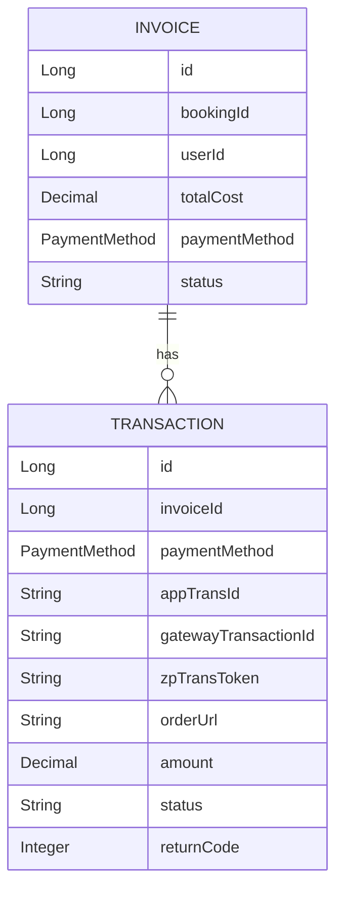
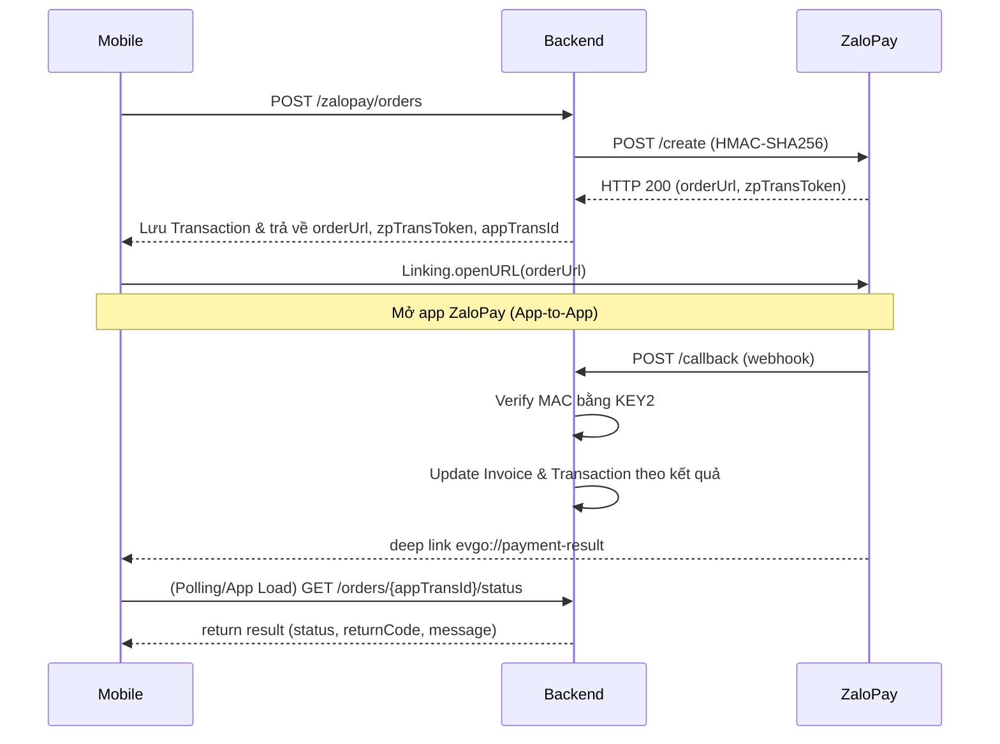

# Tài liệu Walkthrough - Payment Module

Module quản lý giao dịch thanh toán của ứng dụng, đặc biệt hỗ trợ quy trình App-to-App payment qua cổng thanh toán ZaloPay.

---

## Tổng quan Module

| Thuộc tính | Giá trị |
|------------|---------|
| **Package** | `com.project.evgo.payment` |
| **Display Name** | Payment Management |
| **Số Services** | 1 (ZaloPayService) |
| **Số Controllers** | 1 (ZaloPayController) |

---

## Mô hình dữ liệu



---

## API Endpoints

### Payment APIs

| Method | Endpoint | Mô tả | Role |
|--------|----------|-------|------|
| `POST` | `/api/v1/zalopay/orders` | Tạo link thanh toán đơn hàng | USER |
| `POST` | `/api/v1/zalopay/callback` | Webhook (IPN) nhận kết quả từ ZaloPay | PUBLIC |
| `GET` | `/api/v1/zalopay/orders/{appTransId}/status` | Kiểm tra trạng thái đơn hàng thủ công | USER |
| `GET` | `/api/v1/invoices/booking/{bookingId}` | Lấy thông tin Invoice theo ID của Booking | USER |
| `GET` | `/api/v1/invoices/session/{sessionId}` | Lấy thông tin Invoice theo ID của Charging Session | USER |

> [!NOTE]
> IPN `/api/v1/zalopay/callback` không yêu cầu JWT Auth nhưng tính hợp lệ được xác thực bằng chữ ký số qua HMAC-SHA256 (bằng KEY2).
> Thực thể `Invoice` KHÔNG được sinh ra trực tiếp bởi `BookingService`. Thay vào đó, nó được sinh ra thông qua `PaymentModuleListener` (Spring Modulith Event-Driven) lắng nghe sự kiện `BookingCreatedEvent` từ module `booking`.

---

## Service Interfaces

### ZaloPayService

```java
public interface ZaloPayService {
    // Owner-specific APIs
    ZaloPayOrderResponse createOrder(ZaloPayOrderRequest request);
    ZaloPayStatusResponse queryOrderStatus(String appTransId);
    
    // Webhook IPN Callback
    void handleCallback(ZaloPayCallbackRequest callbackRequest);
}
```

---

## Luồng thanh toán (Payment Flow)



---

## Request/Response DTOs

### ZaloPayOrderRequest

```java
public record ZaloPayOrderRequest(
    @NotNull Long invoiceId,
    @NotNull Long userId,
    @NotNull BigDecimal amount,
    @NotBlank String description
) {}
```

### ZaloPayOrderResponse

```java
public record ZaloPayOrderResponse(
    String orderUrl,
    String zpTransToken,
    String appTransId
) {}
```

### ZaloPayCallbackRequest

Payload gửi từ IPN ZaloPay:

```java
public record ZaloPayCallbackRequest(
    String data,   // JSON dạng chuỗi mã hóa kết quả
    String mac,    // Chữ ký bảo vệ data truyền về
    Integer type   // Type callback
) {}
```

### ZaloPayStatusResponse

```java
public record ZaloPayStatusResponse(
    String appTransId,
    String invoiceStatus,
    Integer returnCode,
    String message
) {}
```

---

## Entities

### Invoice Entity

Chứa thông tái hóa đơn chung, không có trường nào liên quan tới một Gateway riêng biệt.

```java
@Entity
@Getter @Setter
@NoArgsConstructor @AllArgsConstructor
@Table(name = "invoices")
public class Invoice {
    @Id
    @GeneratedValue(strategy = GenerationType.IDENTITY)
    private Long id;

    @Column(name = "booking_id", nullable = false)
    private Long bookingId;

    @Column(name = "user_id", nullable = false)
    private Long userId;

    @Column(name = "total_cost", nullable = false)
    private BigDecimal totalCost;

    @Enumerated(EnumType.STRING)
    @Column(name = "payment_method")
    private PaymentMethod paymentMethod;

    @Column(nullable = false)
    private String status = "PENDING"; // PENDING, PAID, CANCELLED, REFUNDED
}
```

### Transaction Entity

Lưu thông tin giao dịch payment của 1 Invoice. Giúp bóc tách Token, Redirect URL riêng khỏi hóa đơn chung.

```java
@Entity
@Getter @Setter
@NoArgsConstructor @AllArgsConstructor
@Table(name = "transactions")
public class Transaction {
    @Id
    @GeneratedValue(strategy = GenerationType.IDENTITY)
    private Long id;

    @ManyToOne(fetch = FetchType.LAZY)
    @JoinColumn(name = "invoice_id", nullable = false)
    private Invoice invoice;

    @Enumerated(EnumType.STRING)
    @Column(name = "payment_method", nullable = false)
    private PaymentMethod paymentMethod;

    @Column(name = "app_trans_id", unique = true, length = 50)
    private String appTransId;

    @Column(name = "gateway_transaction_id")
    private String gatewayTransactionId; // ID nhận được sau callback

    @Column(name = "zp_trans_token", columnDefinition = "TEXT")
    private String zpTransToken;

    @Column(name = "order_url", columnDefinition = "TEXT")
    private String orderUrl;

    @Column(nullable = false)
    private BigDecimal amount;

    @Column(nullable = false)
    private String status = "PENDING"; // PENDING, SUCCESS, FAILED
    
    @Column(name = "return_code")
    private Integer returnCode;
}
```

> [!NOTE]
> **Ý nghĩa các trường đặc biệt:**
> - `appTransId`: Mã giao dịch trên app của chúng ta tạo, định dạng `yyMMdd_UUID8`.
> - `zpTransToken`: Token thanh toán qua ZaloPay tạo ở api khởi tạo (App-to-App identifier)
> - `orderUrl`: Universal deep link dùng cho phía client (Mobile/Web) gọi trực tiếp qua app ZaloPay

---

## Enums

### PaymentMethod

```java
public enum PaymentMethod {
    MOMO,
    ZALOPAY,
    BANK_TRANSFER
}
```

---

## Các tính năng đã implement

### ZaloPay Integration
- ✅ Tích hợp App-to-App Order Creation để sinh `orderUrl` và `zpTransToken`
- ✅ Webhook Endpoint an toàn để nhận kết quả tự động (Verify MAC bằng KEY2)
- ✅ Update đồng thời Transaction và Invoice sau khi thanh toán thông báo
- ✅ Endpoint Query trạng thái phòng trừ timeout webhooks
- ✅ Luồng cấu hình HMCA256, HTTP Client Request cho sandbox qua WebClient
- ✅ Handle lỗi ErrorCode (10001-10006) của Zalo theo chuẩn enum

---

## File Structure

```
payment/
├── package-info.java              # @ApplicationModule
├── config/
│   └── ZaloPayConfig.java         # @ConfigurationProperties read /application.yaml
├── request/
│   ├── ZaloPayOrderRequest.java
│   └── ZaloPayCallbackRequest.java
├── response/
│   ├── ZaloPayOrderResponse.java
│   └── ZaloPayStatusResponse.java
├── internal/
│   ├── Invoice.java               # Entity
│   ├── Transaction.java           # Entity
│   ├── InvoiceRepository.java
│   ├── TransactionRepository.java
│   ├── ZaloPayServiceImpl.java    # Xử lý logic webhook + call gateway
│   └── web/
│       └── ZaloPayController.java # API Handlers
└── ZaloPayService.java            # Public Interface
```

---

## Dependencies

Module `payment` phụ thuộc vào:
- `sharedkernel` - Lấy ErrorCode, System Enums, Exceptions Base
- `configuration` - Lấy config properties (`zalopay.*`) từ .yaml

Module `payment` đang sử dụng bởi:
- `user` - (Tham khảo chéo) Tái cấu trúc ID của User để gửi yêu cầu đi

---

## Lưu ý quan trọng

1. **Callback (IPN) Mac Verification**: Tuyệt đối không hardcode KEY2 trong code. Được load qua `ZaloPayConfig` bằng env.
2. **Cấu trúc Dữ Liệu**: Việc tách biệt `Invoice` và `Transaction` để dễ quản lý. Lỗi ở giao dịch (Transaction: FAILED) thì Invoice vẫn PENDING để tạo giao dịch khác.
3. **Mã lỗi Webhook**: End-point `/callback` KHÔNG ĐƯỢC trả về lỗi HTTP 4xx hoặc 5xx. Bắt buộc phải trả về JSON format `{"return_code": x}` (x = 1 hoặc x = 0) để Zalo nhận diện thành công hoặc trigger gửi lại theo Rule của IPN.
4. **Client Deep Link**: Client code phải có `evgo://payment-result` cấu hình Intent Filters (Mobile Android/iOS) để App ZaloPay chuyển hướng về.
