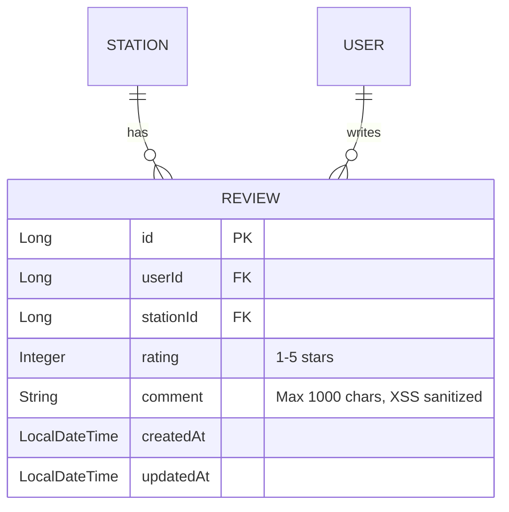
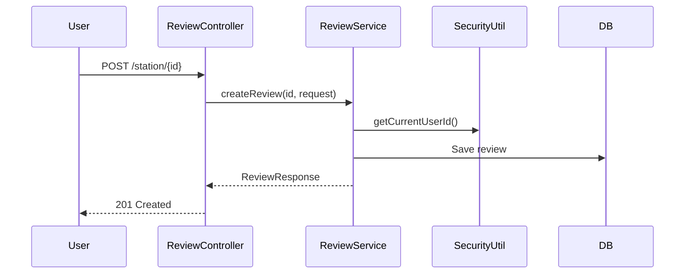
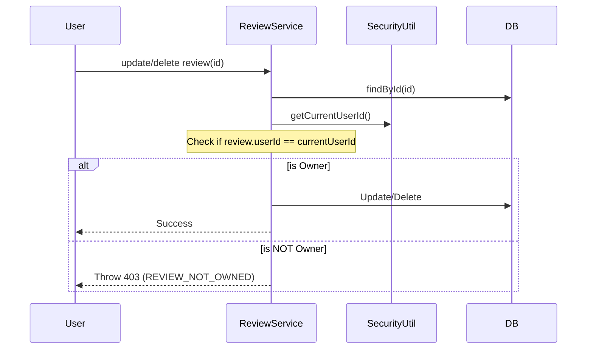

# Tài liệu Walkthrough - Review Module

Module quản lý đánh giá (Review) và nhận xét của người dùng đối với các trạm sạc (Station).

---

## Tổng quan Module

| Thuộc tính | Giá trị |
|------------|---------|
| **Package** | `com.project.evgo.review` |
| **Display Name** | Station Review System |
| **Số Services** | 1 (ReviewService) |
| **Số Controllers** | 1 (ReviewController) |

---

## Mô hình dữ liệu



> [!IMPORTANT]
> **XSS Protection**: Tất cả các `comment` đều được sanitize bằng thư viện **Jsoup** với `Safelist.none()` trước khi lưu xuống database hoặc trả về qua API.

---

## API Endpoints

### Review APIs

| Method | Endpoint | Mô tả | Auth | Role |
|--------|----------|-------|------|------|
| `GET` | `/api/v1/reviews/station/{id}/summary` | Thống kê (AVG, Total, Distribution) | ❌ | Public |
| `GET` | `/api/v1/reviews/station/{id}` | Danh sách review (có đủ user info) | ❌ | Public |
| `POST` | `/api/v1/reviews/station/{id}` | Gửi review mới | ✅ | USER |
| `PUT` | `/api/v1/reviews/{id}` | Cập nhật review (chỉ owner) | ✅ | USER |
| `DELETE` | `/api/v1/reviews/{id}` | Xóa review | ✅ | USER/ADMIN |

---

## Service Interface

```java
public interface ReviewService {
    // Read operations (Public)
    Optional<ReviewResponse> findById(Long id);
    List<ReviewResponse> findByStationId(Long stationId);
    List<ReviewResponse> findByUserId(Long userId);
    Double getAverageRatingByStationId(Long stationId);
    StationReviewsSummaryResponse getReviewSummary(Long stationId);
    PageResponse<ReviewResponse> getStationReviews(Long stationId, Pageable pageable);

    // Business operations (Authenticated)
    ReviewResponse createReview(Long stationId, CreateReviewRequest request);
    ReviewResponse updateReview(Long id, UpdateReviewRequest request);
    void deleteReview(Long id);
}
```

---

## Luồng xử lý chính

### Gửi Review (Create)



### Bảo mật Ownership (Update/Delete)



---

## Request/Response DTOs

### Create/Update Review Request
Dùng **Java record** để đảm bảo tính bất biến:
```java
public record CreateReviewRequest(
    @NotNull Integer rating,
    @Size(max = 1000) String comment
) {}

public record UpdateReviewRequest(
    @NotNull Integer rating,
    @Size(max = 1000) String comment
) {}
```

---

## File Structure

```
review/
├── ReviewService.java                # Public service interface
├── request/
│   ├── CreateReviewRequest.java      # record
│   └── UpdateReviewRequest.java      # record
├── response/
│   ├── ReviewResponse.java           # Includes userName, userAvatar
│   └── StationReviewsSummaryResponse.java # record (AVG, total, distribution)
└── internal/
    ├── Review.java                   # Entity
    ├── ReviewProjection.java         # Interface for native query
    ├── ReviewRepository.java         # Native query with User JOIN
    ├── ReviewDtoConverter.java       # Includes Jsoup sanitization
    ├── ReviewServiceImpl.java        # Ownership validation logic
    └── web/
        └── ReviewController.java
```

---

## Lưu ý quan trọng

1. **Native Query**: Việc fetch danh sách review sử dụng Native Query có JOIN với bảng `users` để tối ưu hiệu năng, thay vì query rời rạc.
2. **Date Formatting**: `ReviewResponse` trả về `createdAt` và `updatedAt` dưới dạng String format ISO-8601 để Client dễ parse.
3. **ErrorCode**: Sử dụng dải error code `12xxx` (ví dụ: `REVIEW_NOT_FOUND: 12001`, `REVIEW_NOT_OWNED: 12003`).
