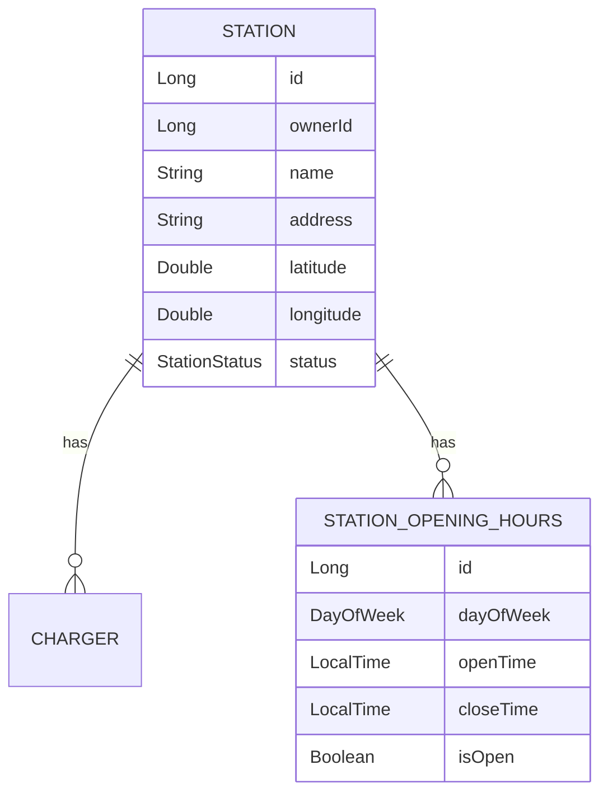
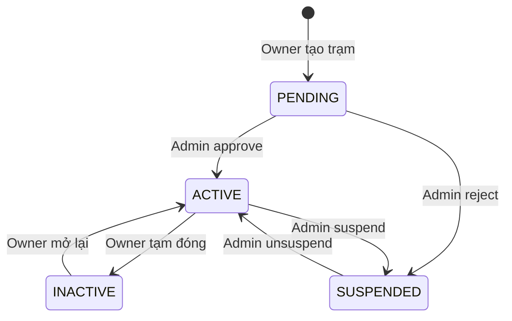

# Tài liệu Walkthrough - Station Module

Module quản lý trạm sạc, cho phép Station Owner tạo, cập nhật và quản lý các trạm sạc xe điện.

---

## Tổng quan Module

| Thuộc tính | Giá trị |
|------------|---------|
| **Package** | `com.project.evgo.station` |
| **Display Name** | Station Management |
| **Số Services** | 2 (StationService, StationAdminService) |
| **Số Controllers** | 2 (StationController, StationAdminController) |

---

## Mô hình dữ liệu



---

## API Endpoints

### Public APIs (Không cần đăng nhập)

| Method | Endpoint | Mô tả |
|--------|----------|-------|
| `GET` | `/api/v1/stations` | Danh sách trạm sạc đang hoạt động |
| `GET` | `/api/v1/stations/{id}` | Chi tiết trạm sạc |
| `GET` | `/api/v1/stations/search/nearby` | Tìm trạm quanh vị trí (theo bán kính) |
| `GET` | `/api/v1/stations/search/text` | Tìm kiếm trạm theo tên/địa chỉ (full-text search) |
| `GET` | `/api/v1/stations/in-bound` | Tìm trạm trong vùng hiển thị bản đồ (viewport) |
| `GET` | `/api/v1/stations/directions` | Tìm đường đi từ điểm A đến B |

### Station Owner APIs

| Method | Endpoint | Mô tả | Role |
|--------|----------|-------|------|
| `GET` | `/api/v1/stations/me` | Danh sách trạm của tôi | STATION_OWNER |
| `POST` | `/api/v1/stations` | Tạo trạm mới (status = PENDING) | STATION_OWNER |
| `PUT` | `/api/v1/stations/{id}` | Cập nhật thông tin trạm | STATION_OWNER |
| `DELETE` | `/api/v1/stations/{id}` | Xóa trạm (soft delete) | STATION_OWNER |
| `PATCH` | `/api/v1/stations/{id}/status` | Cập nhật trạng thái | STATION_OWNER |

### Admin APIs

| Method | Endpoint | Mô tả | Role |
|--------|----------|-------|------|
| `GET` | `/api/v1/admin/stations` | Danh sách trạm (filter by status) | SUPER_ADMIN |
| `GET` | `/api/v1/admin/stations/{id}` | Chi tiết trạm | SUPER_ADMIN |
| `POST` | `/api/v1/admin/stations/{id}/approve` | Duyệt trạm (PENDING → ACTIVE) | SUPER_ADMIN |
| `POST` | `/api/v1/admin/stations/{id}/reject` | Từ chối trạm (PENDING → SUSPENDED) | SUPER_ADMIN |
| `POST` | `/api/v1/admin/stations/{id}/suspend` | Đình chỉ trạm (ACTIVE → SUSPENDED) | SUPER_ADMIN |
| `POST` | `/api/v1/admin/stations/{id}/unsuspend` | Gỡ đình chỉ (SUSPENDED → ACTIVE) | SUPER_ADMIN |

---

## Service Interfaces

### StationService

```java
public interface StationService {
    // Public APIs
    Optional<StationResponse> findById(Long id);
    List<StationResponse> findAll();

    // Owner-specific APIs
    StationResponse create(CreateStationRequest request);
    StationResponse update(Long id, UpdateStationRequest request);
    void delete(Long id);
    List<StationResponse> getMyStations();
    StationResponse updateStatus(Long id, StationStatus status);

    // Cross-module APIs (dùng bởi Charger, Booking modules)
    void verifyOwnership(Long stationId);  // Throws if not owner
    boolean isOwner(Long stationId);       // Returns boolean

    // Search APIs
    List<StationSearchResult> searchNearby(SearchNearbyRequest request);
    List<StationSearchResult> searchByText(SearchTextRequest request);
    List<StationSearchResult> findStationsInBound(Double minLat, Double maxLat, Double minLng, Double maxLng,
            Double userLat, Double userLng, Integer maxResults);
}
```

### StationAdminService

```java
public interface StationAdminService {
    PageResponse<StationResponse> getAllStations(StationStatus status, Pageable pageable);
    StationResponse getStationById(Long stationId);
    void approveStation(Long stationId);
    void rejectStation(Long stationId, String reason);
    void suspendStation(Long stationId, String reason);
    void unsuspendStation(Long stationId);
}
```

---

## Luồng trạng thái (Station Status Flow)



---

## Request/Response DTOs

### CreateStationRequest

```java
public record CreateStationRequest(
    @NotBlank String name,
    String description,
    @NotBlank String address,
    @NotNull Double latitude,
    @NotNull Double longitude,
    List<String> imageUrls,
    List<StationOpeningHoursRequest> openingHours  // Optional: nếu null = 24/7
) {}
```

### UpdateStationRequest

```java
public record UpdateStationRequest(
    @NotBlank String name,
    String description,
    @NotBlank String address,
    @NotNull Double latitude,
    @NotNull Double longitude,
    List<String> imageUrls,
    List<StationOpeningHoursRequest> openingHours
) {}
```

### StationOpeningHoursRequest

Dùng để cấu hình giờ hoạt động của trạm theo từng ngày trong tuần.

```java
public record StationOpeningHoursRequest(
    @NotNull DayOfWeek dayOfWeek,
    LocalTime openTime,
    LocalTime closeTime,
    Boolean isOpen
) {}
```

> [!NOTE]
> **Ý nghĩa các trường:**
> - `dayOfWeek`: Ngày trong tuần (MONDAY, TUESDAY, ...)
> - `openTime` / `closeTime`: Khung giờ hoạt động (VD: `07:00` - `22:00`)
> - `isOpen`: **Cờ xác định trạm có hoạt động ngày đó không**
>   - `true`: Trạm hoạt động, sử dụng `openTime`/`closeTime`
>   - `false`: Trạm **đóng cửa cả ngày** (ngày nghỉ, lễ). Khi này `openTime`/`closeTime` bị bỏ qua

**Ví dụ JSON:**
[
  { "dayOfWeek": "MONDAY", "isOpen": true, "openTime": "07:00", "closeTime": "22:00" },
  { "dayOfWeek": "SUNDAY", "isOpen": false, "openTime": null, "closeTime": null }
]
```

### SearchNearbyRequest

```java
public record SearchNearbyRequest(
    @NotNull Double latitude,
    @NotNull Double longitude,
    @Positive Double radiusKm,      // Default: 5.0
    @Positive Integer maxResults    // Default: 20
) {}
```

### SearchTextRequest

```java
public record SearchTextRequest(
    @NotBlank String query,
    Double latitude,                // Optional (kết hợp để sort theo khoảng cách)
    Double longitude,               // Optional
    @Positive Integer maxResults    // Default: 10
) {}
```

### StationResponse
DTO này có 1 số fields bị duplicated chưa được giải quyết. 
```java
@Builder
public record StationResponse(
    Long id,
    Long ownerId,
    String name,
    String description,
    String address,
    Double latitude,
    Double longitude,
    Double rate,
    StationStatus status,
    List<String> imageUrls,
    Boolean isFlaggedLowQuality,
    Integer availableChargersCount,
    Integer totalChargersCount,
    List<ChargerSummary> chargers,
    List<StationOpeningHoursResponse> openingHours,
    Integer totalPorts,
    Integer availablePorts,
    LocalDateTime createdAt,
    LocalDateTime updatedAt
) {
    /**
     * Charger summary for station detail
     */
    public record ChargerSummary(
        String connectorType,
        Integer available,
        Integer total
    ) {}
}
```
### StationDtoConverter
Gặp tình trạng Circular Dependency chưa giải quyết root cause mà chỉ mới sử dụng @Lazy tại dependency point.

### StationOpeningHoursResponse

```java
@Builder
public record StationOpeningHoursResponse(
    Long id,
    DayOfWeek dayOfWeek,
    LocalTime openTime,
    LocalTime closeTime,
    Boolean isOpen
) {}
```

### StationSearchResult

DTO tối ưu cho việc hiển thị danh sách trạm trên bản đồ và kết quả tìm kiếm.

```java
@Builder
public record StationSearchResult(
    Long id,
    String name,
    String address,
    Double latitude,
    Double longitude,
    Double rate,
    StationStatus status,
    Boolean isFlaggedLowQuality,
    Double distanceKm,             // Khoảng cách từ vị trí user (nếu có)
    Integer availableChargersCount, // Số lượng trụ sạc còn trống
    Integer totalChargersCount      // Tổng số trụ sạc
) {}
```

### RejectStationRequest / SuspendStationRequest

```java
public record RejectStationRequest(String reason) {}
public record SuspendStationRequest(String reason) {}
```

---

## Entities

### Station Entity

```java
@Entity
@Getter @Setter
@NoArgsConstructor @AllArgsConstructor
@Table(name = "stations")
public class Station {
    @Id
    @GeneratedValue(strategy = GenerationType.IDENTITY)
    private Long id;

    @Column(name = "owner_id", nullable = false)
    private Long ownerId;

    @Column(nullable = false)
    private String name;

    @Column(length = 2000)
    private String description;

    @Column(nullable = false)
    private String address;

    private Double latitude;
    private Double longitude;

    @Column(precision = 2)
    private Double rate;

    @Enumerated(EnumType.STRING)
    @Column(nullable = false)
    private StationStatus status = StationStatus.PENDING;

    @Column(name = "is_flagged_low_quality", nullable = false)
    private Boolean isFlaggedLowQuality = false;

    @ElementCollection
    @CollectionTable(name = "station_images", joinColumns = @JoinColumn(name = "station_id"))
    @Column(name = "image_url", length = 500)
    private List<String> imageUrls = new ArrayList<>();

    @OneToMany(mappedBy = "station", cascade = CascadeType.ALL, orphanRemoval = true)
    private List<StationOpeningHours> openingHours = new ArrayList<>();

    private LocalDateTime deletedAt;  // Soft delete field

    @CreationTimestamp
    private LocalDateTime createdAt;

    @UpdateTimestamp
    private LocalDateTime updatedAt;
}
```

> [!NOTE]
> **Ý nghĩa các trường đặc biệt:**
> - `isFlaggedLowQuality`: Cờ đánh dấu trạm có chất lượng thấp (do review tiêu cực hoặc khiếu nại nhiều)
> - `deletedAt`: Thời điểm soft delete. Nếu `!= null` nghĩa là trạm đã bị xóa
> - `rate`: Đánh giá trung bình của trạm (1-5 stars)

### StationOpeningHours Entity

```java
@Entity
@Getter @Setter
@NoArgsConstructor @AllArgsConstructor
@ToString(exclude = "station")
@Table(name = "station_opening_hours")
public class StationOpeningHours {
    @Id
    @GeneratedValue(strategy = GenerationType.IDENTITY)
    private Long id;

    @ManyToOne
    @JoinColumn(name = "station_id", nullable = false)
    private Station station;

    @Enumerated(EnumType.STRING)
    @Column(nullable = false)
    private DayOfWeek dayOfWeek;

    private LocalTime openTime;

    private LocalTime closeTime;

    private Boolean isOpen;
}
```

---

## Enums

### StationStatus

```java
public enum StationStatus {
    PENDING,    // Chờ duyệt (trạm mới tạo)
    ACTIVE,     // Đang hoạt động
    INACTIVE,   // Tạm đóng (bởi owner)
    SUSPENDED   // Bị đình chỉ (bởi admin)
}
```

| Status | Mô tả | Người thay đổi |
|--------|-------|----------------|
| `PENDING` | Trạm mới tạo, chờ Admin duyệt | - |
| `ACTIVE` | Trạm đang hoạt động bình thường | Admin (approve/unsuspend) |
| `INACTIVE` | Tạm ngưng hoạt động | Owner |
| `SUSPENDED` | Bị đình chỉ do vi phạm | Admin (reject/suspend) |

---

## Các tính năng đã implement

### Public Features

- ✅ Xem danh sách trạm sạc đang hoạt động
- ✅ Xem chi tiết thông tin trạm sạc

### Station Owner Features

- ✅ Tạo trạm sạc mới (status = PENDING)
- ✅ Cập nhật thông tin trạm
- ✅ Xóa trạm sạc (soft delete)
- ✅ Quản lý trạng thái trạm (ACTIVE ↔ INACTIVE)
- ✅ Xem danh sách trạm của mình
- ✅ **[NEW]** Cấu hình giờ hoạt động (opening hours)

### Admin Features

- ✅ Xem danh sách trạm với filter theo status
- ✅ Xem chi tiết trạm chờ duyệt
- ✅ Duyệt trạm mới (PENDING → ACTIVE)
- ✅ Từ chối trạm mới (PENDING → SUSPENDED)
- ✅ Đình chỉ trạm đang hoạt động
- ✅ Gỡ đình chỉ trạm

### Cross-module Features

- ✅ `verifyOwnership()` - Xác minh quyền sở hữu (dùng bởi Charger module)
- ✅ `isOwner()` - Kiểm tra quyền sở hữu

---

## File Structure

```
station/
├── package-info.java              # @ApplicationModule
├── StationService.java            # Public service interface
├── StationAdminService.java       # Admin service interface
├── request/
│   ├── CreateStationRequest.java
│   ├── UpdateStationRequest.java
│   ├── StationOpeningHoursRequest.java
│   ├── RejectStationRequest.java
│   └── SuspendStationRequest.java
├── response/
│   ├── StationResponse.java
│   └── StationOpeningHoursResponse.java
└── internal/
    ├── Station.java               # Entity
    ├── StationOpeningHours.java   # Entity
    ├── StationRepository.java
    ├── StationDtoConverter.java
    ├── StationServiceImpl.java
    ├── StationAdminServiceImpl.java
    └── web/
        ├── StationController.java
        └── StationAdminController.java
```

---

## Dependencies

Module `station` phụ thuộc vào:
- `sharedkernel` - DTOs, Enums, Exceptions

Module `station` được sử dụng bởi:
- `charger` - Để xác minh quyền sở hữu trước khi thêm/xóa charger
- `booking` - Để tìm kiếm trạm và đặt lịch

---

## Lưu ý quan trọng

1. **Station Approval Flow**: Trạm mới tạo có `status = PENDING`, cần Admin duyệt trước khi hiển thị public.

2. **Soft Delete**: Khi xóa trạm, field `deletedAt` được set thay vì xóa khỏi DB. Tất cả query đều filter `deletedAt IS NULL`.

3. **Opening Hours Optional**: Nếu không truyền `openingHours` khi tạo/update, trạm mặc định được coi là hoạt động 24/7.

4. **Admin Actions**: Chỉ `SUPER_ADMIN` mới có quyền approve/reject/suspend/unsuspend stations.

5. **Status Validation**: Hệ thống kiểm tra và chặn các chuyển đổi status không hợp lệ (VD: không thể suspend trạm PENDING).
