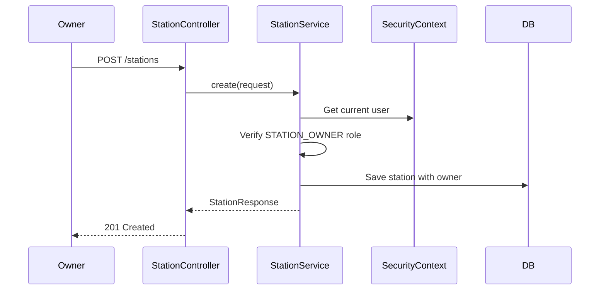
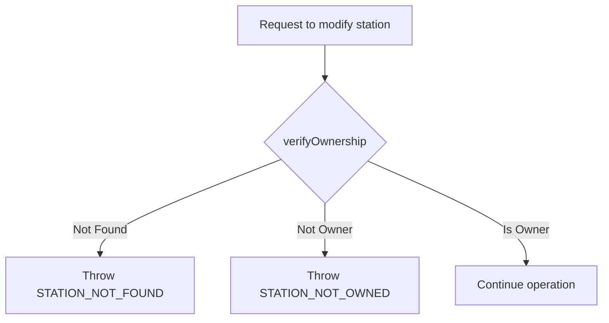

# Tài liệu Walkthrough - Station Module

Module quản lý trạm sạc, cho phép Station Owner tạo, cập nhật và quản lý các trạm sạc xe điện.

---

## Tổng quan Module

| Thuộc tính | Giá trị |
|------------|---------|
| **Package** | `com.project.evgo.station` |
| **Display Name** | Station Management |
| **Số Services** | 1 (StationService) |
| **Số Controllers** | 1 (StationController) |

---

## API Endpoints

| Method | Endpoint | Mô tả | Auth | Role |
|--------|----------|-------|------|------|
| `GET` | `/api/v1/stations` | Danh sách tất cả trạm sạc | ❌ | Public |
| `GET` | `/api/v1/stations/{id}` | Chi tiết trạm sạc | ❌ | Public |
| `GET` | `/api/v1/stations/me` | Danh sách trạm của tôi | ✅ | STATION_OWNER |
| `POST` | `/api/v1/stations` | Tạo trạm sạc mới | ✅ | STATION_OWNER |
| `PUT` | `/api/v1/stations/{id}` | Cập nhật trạm sạc | ✅ | STATION_OWNER |
| `DELETE` | `/api/v1/stations/{id}` | Xóa trạm sạc (soft delete) | ✅ | STATION_OWNER |
| `PATCH` | `/api/v1/stations/{id}/status` | Cập nhật trạng thái trạm | ✅ | STATION_OWNER |

---

## Service Interface

```java
public interface StationService {
    // Public APIs - Cho tất cả người dùng
    Optional<StationResponse> findById(Long id);
    List<StationResponse> findAll();

    // Owner-specific APIs
    StationResponse create(CreateStationRequest request);
    StationResponse update(Long id, UpdateStationRequest request);
    void delete(Long id);
    List<StationResponse> getMyStations();
    StationResponse updateStatus(Long id, StationStatus status);

    // Cross-module APIs
    void verifyOwnership(Long stationId);  // Throws if not owner
    boolean isOwner(Long stationId);       // Returns boolean
}
```

---

## Luồng xử lý chính

### Tạo trạm sạc mới



### Kiểm tra quyền sở hữu



---

## Các tính năng đã implement

### Public Features (Không cần đăng nhập)

- ✅ Xem danh sách tất cả trạm sạc hoạt động
- ✅ Xem chi tiết thông tin trạm sạc
- ✅ Thông tin bao gồm: tên, địa chỉ, tọa độ GPS, trạng thái, giá cả

### Station Owner Features

- ✅ Tạo trạm sạc mới
- ✅ Cập nhật thông tin trạm
- ✅ Xóa trạm sạc (soft delete)
- ✅ Quản lý trạng thái trạm (OPEN, MAINTENANCE, CLOSED)
- ✅ Xem danh sách trạm của mình
- ✅ Thiết lập giá sạc (price per kWh, booking fee)

### Cross-module Features

- ✅ `verifyOwnership()` - Xác minh quyền sở hữu (dùng bởi Charger module)
- ✅ `isOwner()` - Kiểm tra quyền sở hữu (returns boolean)

---

## Request/Response DTOs

### CreateStationRequest

```java
public record CreateStationRequest(
    @NotBlank String name,
    @NotBlank String address,
    @NotNull Double latitude,
    @NotNull Double longitude,
    String description,
    String imageUrl,
    @NotNull Double pricePerKwh,
    Double bookingFee,
    Double cancellationFee
) {}
```

### UpdateStationRequest

```java
public record UpdateStationRequest(
    String name,
    String address,
    Double latitude,
    Double longitude,
    String description,
    String imageUrl,
    Double pricePerKwh,
    Double bookingFee,
    Double cancellationFee
) {}
```

### StationResponse

```java
public record StationResponse(
    Long id,
    String name,
    String address,
    Double latitude,
    Double longitude,
    String description,
    String imageUrl,
    StationStatus status,
    Long ownerId,
    String ownerName,
    PriceSettingResponse priceSetting,
    LocalDateTime createdAt,
    LocalDateTime updatedAt
) {}
```

---

## Entity

### Station Entity

```java
@Entity
@Table(name = "stations")
public class Station {
    @Id
    @GeneratedValue(strategy = GenerationType.IDENTITY)
    private Long id;

    @Column(nullable = false)
    private String name;

    @Column(nullable = false)
    private String address;

    private Double latitude;
    private Double longitude;

    @Column(length = 1000)
    private String description;

    private String imageUrl;

    @Enumerated(EnumType.STRING)
    @Column(nullable = false)
    private StationStatus status = StationStatus.OPEN;

    @ManyToOne(fetch = FetchType.LAZY)
    @JoinColumn(name = "owner_id", nullable = false)
    private User owner;

    @OneToOne(mappedBy = "station", cascade = CascadeType.ALL)
    private PriceSetting priceSetting;

    @CreationTimestamp
    private LocalDateTime createdAt;

    @UpdateTimestamp
    private LocalDateTime updatedAt;
}
```

### PriceSetting Entity

```java
@Entity
@Table(name = "price_settings")
public class PriceSetting {
    @Id
    @GeneratedValue(strategy = GenerationType.IDENTITY)
    private Long id;

    @OneToOne
    @JoinColumn(name = "station_id", nullable = false)
    private Station station;

    @Column(nullable = false)
    private Double pricePerKwh;

    private Double bookingFee;
    private Double cancellationFee;
}
```

---

## Enums

### StationStatus

```java
public enum StationStatus {
    OPEN,           // Đang hoạt động
    MAINTENANCE,    // Đang bảo trì
    CLOSED,         // Đã đóng cửa
    DELETED         // Đã xóa (soft delete)
}
```

---

## File Structure

```
station/
├── package-info.java              # @ApplicationModule
├── StationService.java            # Public service interface
├── request/
│   ├── CreateStationRequest.java
│   └── UpdateStationRequest.java
├── response/
│   └── StationResponse.java
└── internal/
    ├── Station.java               # Entity
    ├── PriceSetting.java          # Entity
    ├── StationRepository.java
    ├── StationDtoConverter.java
    ├── StationServiceImpl.java
    └── web/
        └── StationController.java
```

---

## Dependencies

Module `station` phụ thuộc vào:
- `sharedkernel` - DTOs, Enums, Exceptions
- `user` - Để lấy thông tin owner

Module `station` được sử dụng bởi:
- `charger` - Để xác minh quyền sở hữu trước khi thêm/xóa charger
- `booking` - Để tìm kiếm trạm và đặt lịch

---

## Lưu ý quan trọng

1. **Ownership Verification**: Mọi thao tác write (create, update, delete) đều yêu cầu STATION_OWNER role và kiểm tra quyền sở hữu.

2. **Soft Delete**: Khi xóa trạm, status được chuyển thành DELETED thay vì xóa hoàn toàn khỏi database.

3. **Cross-module API**: `verifyOwnership()` được expose public để Charger module có thể xác minh quyền sở hữu trước khi thêm/xóa charger cho station.
