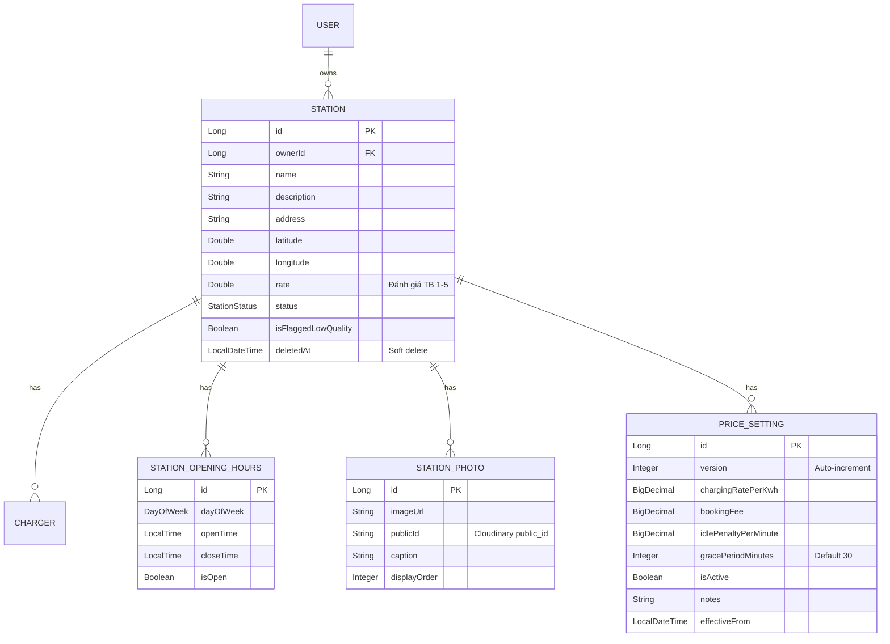
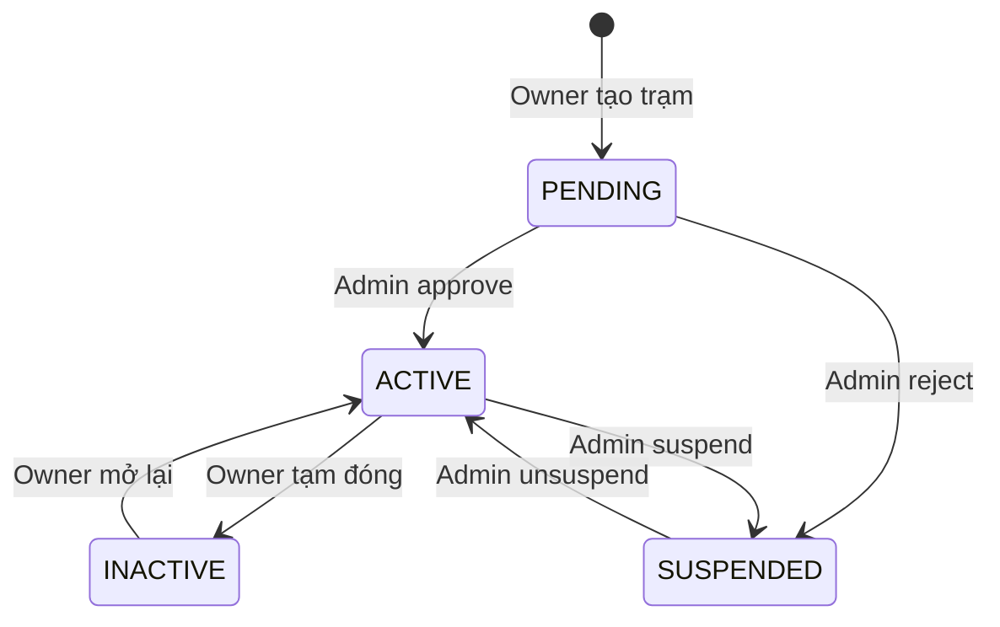

# Tài liệu Walkthrough - Station Module

Module quản lý trạm sạc, cho phép Station Owner tạo, cập nhật và quản lý các trạm sạc xe điện. Hỗ trợ tìm kiếm địa lý, quản lý ảnh, cấu hình bảng giá động, và quy trình duyệt trạm bởi Admin.

---

## Tổng quan Module

| Thuộc tính | Giá trị |
|------------|---------|
| **Package** | `com.project.evgo.station` |
| **Display Name** | Station Management |
| **Số Services** | 4 (StationService, StationAdminService, StationPhotoService, PriceSettingService) |
| **Số Controllers** | 4 (StationController, StationAdminController, StationPhotoController, PriceSettingController) |

---

## Mô hình dữ liệu



---

## API Endpoints

### Public APIs (Không cần đăng nhập)

| Method | Endpoint | Mô tả |
|--------|----------|-------|
| `GET` | `/api/v1/stations` | Danh sách trạm sạc đang hoạt động |
| `GET` | `/api/v1/stations/{id}` | Chi tiết trạm sạc (kèm chargers, hours, photos) |
| `GET` | `/api/v1/stations/search/nearby` | Tìm trạm quanh vị trí (theo bán kính km) |
| `GET` | `/api/v1/stations/search/text` | Tìm kiếm full-text theo tên/địa chỉ |
| `GET` | `/api/v1/stations/in-bound` | Tìm trạm trong viewport bản đồ |
| `GET` | `/api/v1/stations/directions` | Tìm đường đi từ A → B |
| `GET` | `/api/v1/stations/{id}/photos` | Ảnh trạm sạc |
| `GET` | `/api/v1/stations/{id}/pricing` | Bảng giá hiện tại |
| `GET` | `/api/v1/stations/{id}/pricing/calculate-idle-fee?overstayMinutes=N` | Tính phí phạt quá giờ |
| `GET` | `/api/v1/stations/metadata` | Power range, connector types, statuses cho Filter UI |
| `GET` | `/api/v1/stations/filter` | Lọc trạm theo power, connectorType, status (all optional) |

### Station Owner APIs

| Method | Endpoint | Mô tả |
|--------|----------|-------|
| `GET` | `/api/v1/stations/me` | Danh sách trạm của tôi |
| `POST` | `/api/v1/stations` | Tạo trạm mới (status=PENDING) |
| `PUT` | `/api/v1/stations/{id}` | Cập nhật thông tin trạm |
| `DELETE` | `/api/v1/stations/{id}` | Xóa trạm (soft delete) |
| `PATCH` | `/api/v1/stations/{id}/status` | Cập nhật trạng thái (ACTIVE↔INACTIVE) |

### Station Photo APIs (STATION_OWNER)

| Method | Endpoint | Mô tả |
|--------|----------|-------|
| `POST` | `/api/v1/stations/{id}/photos` | Upload ảnh (multipart, max 10) |
| `PUT` | `/api/v1/stations/{id}/photos/{photoId}` | Cập nhật caption/thứ tự |
| `DELETE` | `/api/v1/stations/{id}/photos/{photoId}` | Xóa ảnh (cleanup Cloudinary) |
| `PUT` | `/api/v1/stations/{id}/photos/reorder` | Sắp xếp lại thứ tự ảnh |

### Station Pricing APIs (STATION_OWNER)

| Method | Endpoint | Mô tả |
|--------|----------|-------|
| `POST` | `/api/v1/stations/{id}/pricing` | Tạo version bảng giá mới |
| `GET` | `/api/v1/stations/{id}/pricing/history` | Lịch sử thay đổi bảng giá |

### Admin APIs (SUPER_ADMIN)

| Method | Endpoint | Mô tả |
|--------|----------|-------|
| `GET` | `/api/v1/admin/stations` | Danh sách trạm (filter by status, paginated) |
| `GET` | `/api/v1/admin/stations/{id}` | Chi tiết trạm |
| `POST` | `/api/v1/admin/stations/{id}/approve` | Duyệt trạm (PENDING → ACTIVE) |
| `POST` | `/api/v1/admin/stations/{id}/reject` | Từ chối trạm (PENDING → SUSPENDED) |
| `POST` | `/api/v1/admin/stations/{id}/suspend` | Đình chỉ trạm (ACTIVE → SUSPENDED) |
| `POST` | `/api/v1/admin/stations/{id}/unsuspend` | Gỡ đình chỉ (SUSPENDED → ACTIVE) |

---

## Luồng trạng thái (Station Status Flow)



| Status | Mô tả | Hiển thị Public | Người thay đổi |
|--------|-------|-----------------|-----------------|
| `PENDING` | Chờ duyệt | ❌ | — |
| `ACTIVE` | Đang hoạt động | ✅ | Admin (approve/unsuspend) |
| `INACTIVE` | Tạm ngưng | ❌ | Owner |
| `SUSPENDED` | Bị đình chỉ | ❌ | Admin (reject/suspend) |

---

## Service Interfaces

### StationService

```java
public interface StationService {
    // Public
    Optional<StationResponse> findById(Long id);
    List<StationResponse> findAll();

    // Owner
    StationResponse create(CreateStationRequest request);
    StationResponse update(Long id, UpdateStationRequest request);
    void delete(Long id);                              // Soft delete
    List<StationResponse> getMyStations();
    StationResponse updateStatus(Long id, StationStatus status);

    // Cross-module (dùng bởi Charger module)
    void verifyOwnership(Long stationId);              // Throws STATION_NOT_OWNED
    boolean isOwner(Long stationId);

    // Search
    List<StationSearchResult> searchNearby(SearchNearbyRequest request);
    List<StationSearchResult> searchByText(SearchTextRequest request);
    List<StationSearchResult> findStationsInBound(...);
}
```

### PriceSettingService

```java
public interface PriceSettingService {
    PriceSettingResponse createPriceSetting(Long stationId, CreatePriceSettingRequest request);
    PriceSettingResponse getActivePriceSetting(Long stationId);
    List<PriceSettingResponse> getPricingHistory(Long stationId);
    BigDecimal calculateIdleFee(Long stationId, int overstayMinutes);
}
```

> [!NOTE]
> **Pricing Versioning**: Mỗi lần tạo bảng giá mới, version cũ tự động bị deactivate. Bảng giá là immutable — không sửa, chỉ tạo mới.
> **Idle Fee**: `max(0, overstayMinutes - gracePeriodMinutes) × idlePenaltyPerMinute`. Nếu penalty = null/0 → phí luôn = 0.

---

## StationResponse (chi tiết)

```java
@Builder
public record StationResponse(
    Long id, Long ownerId, String name, String description,
    String address, Double latitude, Double longitude,
    Double rate, StationStatus status,
    List<String> imageUrls,
    Boolean isFlaggedLowQuality,
    Integer availableChargersCount,      // Tính từ ChargerStatisticProjection
    Integer totalChargersCount,
    List<ChargerSummary> chargers,       // Group by connectorType
    List<StationOpeningHoursResponse> openingHours,
    Integer totalPorts, Integer availablePorts,
    LocalDateTime createdAt, LocalDateTime updatedAt
) {
    public record ChargerSummary(
        String connectorType,
        Integer available,
        Integer total
    ) {}
}
```

> [!WARNING]
> **Một số field bị duplicate chưa giải quyết:**
> - `imageUrls` (from Station entity) vs Photos (from StationPhoto entity) — hiện tại tồn tại cả 2 cơ chế lưu ảnh.
> - `totalPorts`/`availablePorts` có thể tính trùng với thông tin trong `chargers[].available/total`.

---

## File Structure

```
station/
├── package-info.java                    # @ApplicationModule
├── StationService.java                  # Public service interface
├── StationAdminService.java             # Admin service interface
├── StationPhotoService.java             # Photo management interface
├── PriceSettingService.java             # Pricing interface
├── request/
│   ├── CreateStationRequest.java
│   ├── UpdateStationRequest.java
│   ├── StationOpeningHoursRequest.java
│   ├── SearchNearbyRequest.java
│   ├── SearchTextRequest.java
│   ├── RejectStationRequest.java
│   ├── SuspendStationRequest.java
│   ├── AddStationPhotoRequest.java      # Multipart file upload
│   ├── UpdateStationPhotoRequest.java
│   ├── ReorderStationPhotosRequest.java
│   └── CreatePriceSettingRequest.java
├── response/
│   ├── StationResponse.java            # Includes ChargerSummary
│   ├── StationSearchResult.java        # Lightweight (for map/search)
│   ├── StationOpeningHoursResponse.java
│   ├── StationPhotoResponse.java
│   └── PriceSettingResponse.java
└── internal/
    ├── Station.java                     # Entity
    ├── StationOpeningHours.java         # Entity
    ├── StationPhoto.java                # Entity (Cloudinary)
    ├── PriceSetting.java                # Entity (versioned, immutable)
    ├── StationRepository.java           # Custom queries (nearby, text search)
    ├── StationPhotoRepository.java
    ├── PriceSettingRepository.java
    ├── StationDtoConverter.java         # ⚠️ Uses @Lazy ChargerService
    ├── StationPhotoDtoConverter.java
    ├── PriceSettingDtoConverter.java
    ├── StationServiceImpl.java
    ├── StationAdminServiceImpl.java
    ├── StationPhotoServiceImpl.java     # Cloudinary integration
    ├── PriceSettingServiceImpl.java
    └── web/
        ├── StationController.java
        ├── StationAdminController.java
        ├── StationPhotoController.java
        └── PriceSettingController.java
```

---

## Dependencies

```
station → sharedkernel (Enums, Exceptions, DTOs)
station → charger      (ChargerService.findStatisticsByStationId — for ChargerSummary)

charger → station      (StationService.verifyOwnership — for ownership check)
```
---

## Lưu ý quan trọng

1. **Station Approval Flow**: Trạm mới tạo có `status = PENDING`, cần Admin duyệt trước khi hiển thị public. Tất cả public query filter `status = ACTIVE AND deletedAt IS NULL`.

2. **Soft Delete**: Khi xóa trạm, field `deletedAt` được set thay vì xóa khỏi DB.

3. **Opening Hours Optional**: Nếu không truyền `openingHours` khi tạo/update → trạm mặc định 24/7.

4. **Photo Management**: Upload qua multipart → lưu Cloudinary → trả về URL. Khi xóa ảnh, hệ thống cleanup cả trên Cloudinary (via `publicId`). Tối đa 10 ảnh/trạm.

5. **Price Versioning**: Bảng giá là immutable. Tạo mới → version cũ auto deactivate. Grace period mặc định 30 phút.

6. **Geo Search**: `searchNearby()` dùng Haversine formula trong SQL. `searchByText()` dùng `ILIKE` trên `name` và `address`.

7. **Cross-module API**: `verifyOwnership(stationId)` xác nhận user hiện tại (từ SecurityContext) là owner. Ném `STATION_NOT_OWNED` nếu không phải. Được dùng bởi Charger module trước mỗi thao tác ghi.

8. **Status Validation**: Hệ thống chặn chuyển đổi status không hợp lệ (VD: không thể suspend trạm PENDING, owner không thể tự approve).
