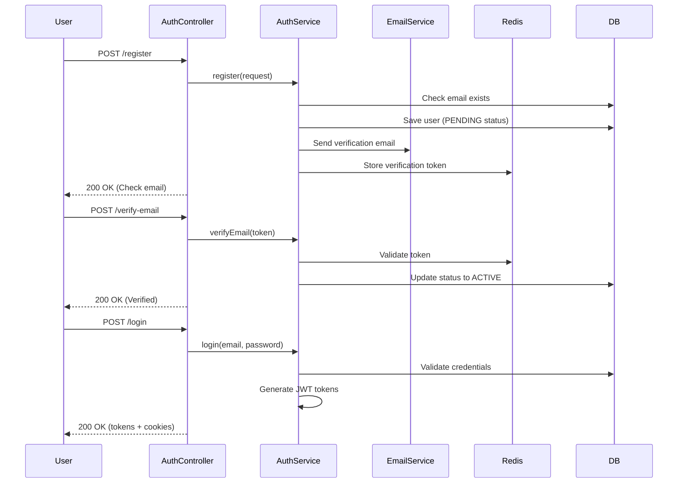
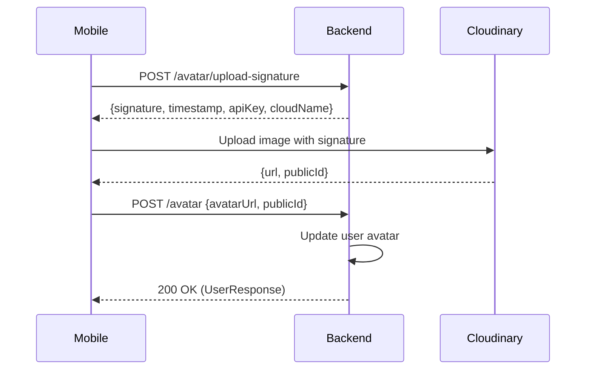
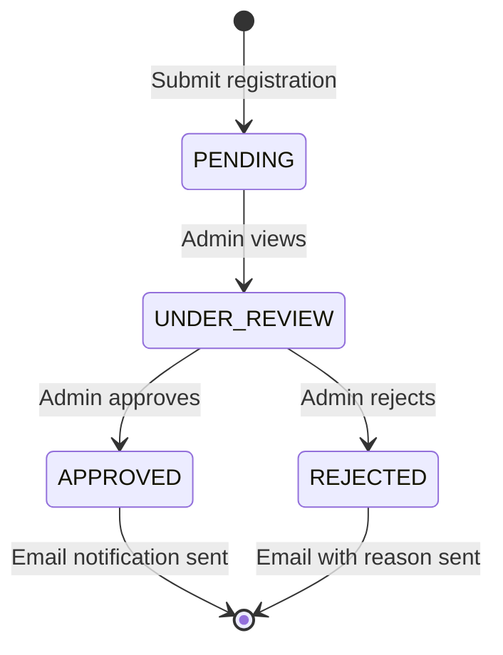

# Tài liệu Walkthrough - User Module

Module quản lý người dùng là module lớn nhất trong hệ thống EV-Go, bao gồm các chức năng xác thực, quản lý hồ sơ, quản lý tài khoản (Admin) và quản lý phương tiện.

---

## Tổng quan Module

| Thuộc tính | Giá trị |
|------------|---------|
| **Package** | `com.project.evgo.user` |
| **Display Name** | User Management |
| **Số Services** | 7 (AuthService, UserService, AccountManagementService, VehicleService, AdminReviewService, StationOwnerService, FileRegistrationService) |
| **Số Controllers** | 6 (AuthController, UserController, AdminController, VehicleController, VehicleCatalogController, GuestController) |

---

## 1. Authentication (AuthService)

### Mô tả
Cung cấp các chức năng xác thực người dùng bao gồm đăng ký, đăng nhập, xác minh email/phone, quên mật khẩu và đăng nhập Google OAuth.

### API Endpoints

| Method | Endpoint | Mô tả | Auth |
|--------|----------|-------|------|
| `POST` | `/api/v1/auth/register` | Đăng ký tài khoản mới | ❌ |
| `POST` | `/api/v1/auth/login` | Đăng nhập | ❌ |
| `POST` | `/api/v1/auth/refresh` | Làm mới access token | ❌ |
| `POST` | `/api/v1/auth/logout` | Đăng xuất | ✅ |
| `POST` | `/api/v1/auth/verify-email` | Xác minh email | ❌ |
| `POST` | `/api/v1/auth/verify-phone` | Xác minh số điện thoại | ❌ |
| `POST` | `/api/v1/auth/resend-verification` | Gửi lại mã xác minh | ❌ |
| `POST` | `/api/v1/auth/forgot-password` | Yêu cầu đặt lại mật khẩu | ❌ |
| `POST` | `/api/v1/auth/reset-password` | Đặt lại mật khẩu với token | ❌ |
| `POST` | `/api/v1/auth/google` | Đăng nhập bằng Google | ❌ |
| `POST` | `/api/v1/auth/station-owner/register` | Đăng ký Station Owner (upload file) | ❌ |

### Luồng xử lý chính



### Các tính năng đã implement

- ✅ Đăng ký với email/phone
- ✅ Xác minh email qua token
- ✅ Xác minh phone qua OTP (mock)
- ✅ Đăng nhập với email/phone + password
- ✅ JWT token với refresh token
- ✅ Token blacklist (via Redis)
- ✅ Google OAuth login
- ✅ Quên/đặt lại mật khẩu
- ✅ Station Owner registration với PDF upload

### Files liên quan

| File | Vai trò |
|------|---------|
| `AuthService.java` | Service interface (public) |
| `internal/AuthServiceImpl.java` | Implementation |
| `internal/web/AuthController.java` | REST Controller |
| `security/JwtTokenProvider.java` | JWT token generation/validation |
| `security/JwtAuthenticationFilter.java` | Authentication filter |
| `internal/token/TokenBlacklistService.java` | Token blacklist management |

---

## 2. User Profile (UserService)

### Mô tả
Quản lý thông tin hồ sơ người dùng, bao gồm cập nhật profile, đổi mật khẩu, và quản lý avatar.

### API Endpoints

| Method | Endpoint | Mô tả | Auth | Role |
|--------|----------|-------|------|------|
| `GET` | `/api/v1/users/me` | Lấy thông tin profile hiện tại | ✅ | Any |
| `PUT` | `/api/v1/users/me` | Cập nhật profile | ✅ | Any |
| `PUT` | `/api/v1/users/me/password` | Đổi mật khẩu | ✅ | Any |
| `POST` | `/api/v1/users/me/avatar/upload-signature` | Lấy Cloudinary signature | ✅ | Any |
| `POST` | `/api/v1/users/me/avatar` | Cập nhật avatar URL | ✅ | Any |
| `GET` | `/api/v1/users/me/business-profile` | Lấy business profile | ✅ | STATION_OWNER |
| `PUT` | `/api/v1/users/me/business-profile` | Cập nhật business profile | ✅ | STATION_OWNER |

### Luồng upload Avatar (Cloudinary)



### Các tính năng đã implement

- ✅ Xem thông tin profile
- ✅ Cập nhật thông tin cơ bản (fullName, phone, gender, birthday)
- ✅ Đổi mật khẩu (yêu cầu mật khẩu cũ)
- ✅ Upload avatar qua Cloudinary (signed upload)
- ✅ Business profile cho Station Owner

---

## 3. Account Management (AccountManagementService)

### Mô tả
Chức năng dành cho Super Admin để quản lý tất cả tài khoản trong hệ thống.

### API Endpoints

| Method | Endpoint | Mô tả | Auth | Role |
|--------|----------|-------|------|------|
| `GET` | `/api/v1/admin/accounts` | Danh sách tài khoản (paginated) | ✅ | SUPER_ADMIN |
| `GET` | `/api/v1/admin/accounts/{userId}` | Chi tiết tài khoản | ✅ | SUPER_ADMIN |
| `POST` | `/api/v1/admin/accounts/{userId}/lock` | Khóa tài khoản | ✅ | SUPER_ADMIN |
| `POST` | `/api/v1/admin/accounts/{userId}/unlock` | Mở khóa tài khoản | ✅ | SUPER_ADMIN |
| `DELETE` | `/api/v1/admin/accounts/{userId}` | Xóa tài khoản (soft delete) | ✅ | SUPER_ADMIN |

### Các tính năng đã implement

- ✅ Danh sách tài khoản với filter (status, role, search)
- ✅ Pagination và sorting
- ✅ Chi tiết tài khoản
- ✅ Khóa tài khoản (BLOCKED status)
- ✅ Mở khóa tài khoản (ACTIVE status)
- ✅ Soft delete (DELETED status)

---

## 4. Station Owner Review (AdminReviewService)

### Mô tả
Quy trình duyệt đơn đăng ký Station Owner bởi Admin.

### API Endpoints

| Method | Endpoint | Mô tả | Auth | Role |
|--------|----------|-------|------|------|
| `GET` | `/api/v1/admin/station-owner` | Danh sách đơn đăng ký | ✅ | SUPER_ADMIN |
| `GET` | `/api/v1/admin/station-owner/{profileId}` | Chi tiết đơn đăng ký | ✅ | SUPER_ADMIN |
| `PUT` | `/api/v1/admin/station-owner/{profileId}` | Đánh dấu đang xem xét | ✅ | SUPER_ADMIN |
| `POST` | `/api/v1/admin/station-owner/{profileId}/approve` | Duyệt đơn | ✅ | SUPER_ADMIN |
| `POST` | `/api/v1/admin/station-owner/{profileId}/reject` | Từ chối đơn | ✅ | SUPER_ADMIN |

### Luồng duyệt đơn



### Các tính năng đã implement

- ✅ Danh sách đơn đăng ký với filter theo status
- ✅ Chi tiết đơn đăng ký (bao gồm thông tin từ PDF)
- ✅ Duyệt đơn (gán role STATION_OWNER, gửi email)
- ✅ Từ chối đơn với lý do
- ✅ PDF parsing để trích xuất thông tin

---

## 5. Vehicle Management (VehicleService)

### Mô tả
Quản lý phương tiện của người dùng, hỗ trợ tìm kiếm trạm sạc phù hợp.

### API Endpoints

| Method | Endpoint | Mô tả | Auth |
|--------|----------|-------|------|
| `POST` | `/api/v1/users/me/vehicles` | Thêm phương tiện mới | ✅ |
| `GET` | `/api/v1/users/me/vehicles` | Danh sách phương tiện | ✅ |
| `GET` | `/api/v1/users/me/vehicles/{id}` | Chi tiết phương tiện | ✅ |
| `PUT` | `/api/v1/users/me/vehicles/{id}` | Cập nhật phương tiện | ✅ |
| `DELETE` | `/api/v1/users/me/vehicles/{id}` | Xóa phương tiện | ✅ |
| `PUT` | `/api/v1/users/me/vehicles/{id}/in-use` | Đặt làm xe đang sử dụng | ✅ |
| `GET` | `/api/v1/users/me/vehicles/in-use` | Lấy xe đang sử dụng | ✅ |

### Các tính năng đã implement

- ✅ CRUD phương tiện
- ✅ Đánh dấu xe đang sử dụng (để tìm trạm sạc phù hợp)
- ✅ Thông tin xe: tên, loại connector, dung lượng pin, công suất sạc max

---

## 6. Station Owner Tracking (StationOwnerService)

### Mô tả
Cho phép người đăng ký Station Owner theo dõi trạng thái đơn của mình.

### API Endpoints

| Method | Endpoint | Mô tả | Auth |
|--------|----------|-------|------|
| `POST` | `/api/v1/guest/track-registration` | Kiểm tra trạng thái đơn | ❌ |

### Các tính năng đã implement

- ✅ Tra cứu trạng thái đơn đăng ký bằng email + mã số đăng ký

---

## Entities

### User Entity

```java
@Entity
@Table(name = "users")
public class User {
    Long id;
    String email;
    String phoneNumber;
    String password;
    String fullName;
    UserGender gender;
    LocalDate birthday;
    String avatarUrl;
    String avatarPublicId;
    UserStatus status;           // PENDING, ACTIVE, BLOCKED, DELETED
    AuthProvider authProvider;   // LOCAL, GOOGLE
    Set<Role> roles;
    LocalDateTime createdAt;
    LocalDateTime updatedAt;
}
```

### Vehicle Entity

```java
@Entity
@Table(name = "vehicles")
public class Vehicle {
    Long id;
    User owner;
    String name;
    ConnectorType connectorType;
    Double batteryCapacity;
    Double maxChargingPower;
    Boolean isInUse;
    LocalDateTime createdAt;
    LocalDateTime updatedAt;
}
```

### StationOwnerProfile Entity

```java
@Entity
@Table(name = "station_owner_profiles")
public class StationOwnerProfile {
    Long id;
    User user;
    String businessName;
    String businessLicenseNumber;
    String taxId;
    String businessAddress;
    String representativeName;
    String phoneNumber;
    StationOwnerType type;       // INDIVIDUAL, COMPANY
    StationOwnerStatus status;   // PENDING, UNDER_REVIEW, APPROVED, REJECTED
    String registrationFileUrl;
    String rejectionReason;
    LocalDateTime submittedAt;
    LocalDateTime reviewedAt;
}
```

---

## Dependencies

Module `user` phụ thuộc vào:
- `sharedkernel` - DTOs, Enums, Exceptions
- `notification` - Gửi email xác minh, thông báo

Module `user` expose public subpackage:
- `user::security` - JwtTokenProvider, JwtAuthenticationFilter (cho module config sử dụng)
